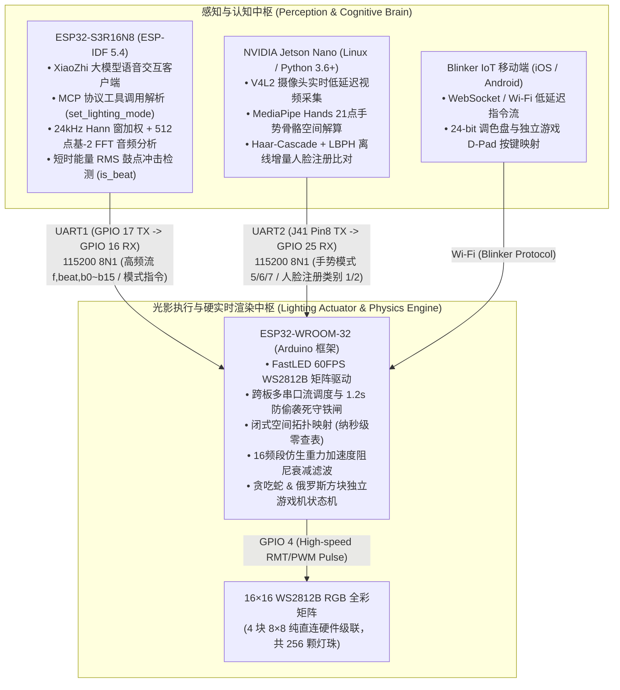
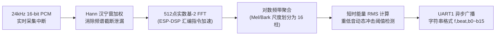

# 基于异构多计算节点的嵌入式 AI 光影交互控制系统
### Distributed Intelligent Lighting & Acoustic Interactive System (Heterogeneous Mid-Stage Architecture)

<p align="left">
  <b>语言切换 / Language Switch / 言語切替:</b><br>
  <a href="README.md"><b>🇨🇳 简体中文</b></a> | 
  <a href="README_EN.md"><b>🇺🇸 English</b></a> | 
  <a href="README_JA.md"><b>🇯🇵 日本語</b></a>
</p>

[](https://idf.espressif.com/)
[](https://www.arduino.cc/)
[](https://developer.nvidia.com/embedded/jetson-nano)
[](https://fastled.io/)
[]()
[](https://www.bilibili.com/video/BV192GR6kEHy)
[](LICENSE)

> 💡 **项目工程定位与系列演进**  
> 本系统是**智能光影交互系统三部曲之【中阶进阶】**，面向高实时性、多模态感官联动的**异构嵌入式分布式光影交互终端**。系统采用 **“双单片机非对称硬件调度 + 边缘 Linux AI 视觉协同”** 架构，将多模态感知（大模型语音、24kHz 对数 FFT 音频流、MediaPipe 21 点骨骼手势、LBPH 人脸识别）与 60FPS 硬实时光影渲染彻底解耦，实现了零查表空间拓扑解算、仿生重力阻尼音频随动滤波、全防御防偷袭串口状态机以及独立运行的经典点阵游戏引擎。  
> 🔗 **三部曲成长轨迹**：  
> - ⏪ **初阶基石归档**：[Intelligent-Lighting-Control-System-Basic](https://github.com/DongFengPo1412/Intelligent-Lighting-Control-System-Basic)（ASRPRO 离线端侧语音 + 基础点阵声光物理原型）  
> - ⏩ **下一代高阶演进**：[Intelligent-Lighting-Control-System-Pro](https://github.com/DongFengPo1412/Intelligent-Lighting-Control-System-Pro)（单芯片 ESP32-S3 原生 RMT 驱动归一化重构 + 本地大模型具身 Agent）

---

## 📺 1. 实机功能与多模态交互演示 (Visual Demonstrations)

系统所有硬件模块均经过实机焊接、电气隔离调优与联调运行，下表展示了系统的核心交互场景：

| 硬件实物与电气连接全景 | 16 频段实时音频对数频谱与重力律动 |
| :---: | :---: |
| <br><sub><b>图 1-1：三节点异构硬件布局（ESP32-S3 大脑、WROOM-32 渲染端、Jetson Nano 视觉端与 256 点阵）</b></sub> | <br><sub><b>图 1-2：真 24kHz 对数 FFT 16 频段音频随动，重低音冲击与仿生重力阻尼滤波实测</b></sub> |
| **独立街机游戏引擎与移动端 D-Pad 遥控** | **边缘视觉端手势识别与人脸注册联动** |
| <br><sub><b>图 1-3：Blinker 手机 App 实时操控贪吃蛇（左）与俄罗斯方块（右），支持 5×3 点阵结算记分</b></sub> | <br><sub><b>图 1-4：Jetson Nano 实时人脸识别（左，触发专属基色）与骨骼手势追踪（右，胜利✌️手势触发流星模式）</b></sub> |

* 完整实机功能演示视频已发布在 Bilibili：  
  👉 **[点击观看实机演示视频：智能光影交互系统实机运行全纪录](https://www.bilibili.com/video/BV192GR6kEHy)**  
  *(涵盖大模型语音交互呼叫、14 种动态灯效切换、Blinker 手机遥控、贪吃蛇/俄罗斯方块游戏机、Jetson Nano 骨骼手势/人脸识别以及音乐高频实时频谱随动)*

---

## 🏛️ 2. 系统异构分布式架构 (System Architecture)

系统由三个异构计算节点组成，通过硬件 UART 异步串口总线与局域网 Wi-Fi 进行松耦合数据交互，彻底消除单片机在重度图像/音频处理与高频 LED 驱动间的时序竞争：



---

## 🔌 3. 硬件规格与电气接线安全规范 (Hardware & Electrical Guide)

### 3.1 物理引脚互联拓扑

| 信号总线 / 接口 | 源设备引脚 (Source Pin) | 目标设备引脚 (Target Pin) | 通信电气参数与协议 | 关键功能与安全保护考量 |
| :--- | :--- | :--- | :--- | :--- |
| **S3 ↔ WROOM UART1** | ESP32-S3 **GPIO 17 (TX)** | WROOM-32 **GPIO 16 (RX2)** | 115200 8N1 单向高速流 | 传输 `f,beat,b0~b15`（~46.8 pkt/s）与模式控制 |
| **S3 ↔ WROOM 反向** | ESP32-S3 **GPIO 18 (RX)** | WROOM-32 **GPIO 17 (TX2)** | 115200 8N1 预留回传 | 系统运行状态与心跳确认 |
| **Jetson ↔ WROOM UART2**| Jetson Nano **J41 Pin 8 (TX)** | WROOM-32 **GPIO 25 (RX)** | 115200 8N1 触发指令 | 发送手势编号（5/6/7）与人脸认证类别（1/2） |
| **WS2812B 驱动总线** | WROOM-32 **GPIO 4** | 矩阵 **DIN** 数据输入脚 | 800kHz 单总线归零码 | 驱动 256 颗灯珠实现 60FPS 平滑刷新 |
| **矩阵独立电源回路** | 外部 5V 稳压电源模块 | 矩阵 **VCC / GND** | 5V / 3A 额定输出 | 必须与 ESP32、Jetson 严密共地 (Common GND) |

### 3.2 关键电气保护与硬件约束

1. **WS2812B 动态削峰限流保护**：  
   256 颗全彩 LED 在全白高亮下的瞬态理论电流可达 $256 \times 60\,\text{mA} \approx 15.36\,\text{A}$。为了确保小型实验电源不被拉垮导致单片机欠压重启（Brownout Reset），固件在 `esp32-wroom-32-arduino.ino` 中硬性启用了 FastLED 动态功耗约束：
   ```cpp
   FastLED.setMaxPowerInVoltsAndMilliamps(5, 1200); // 严格钳位在 5V/1.2A 阈值内
   ```
2. **严防 Jetson Nano 5V 倒灌击穿（Crucial Warning）**：  
   > ⚠️ **警告**：ESP32-WROOM-32 与 Jetson Nano 均使用独立 USB/电源适配器供电。两板之间**严禁连接 5V 针脚**，否则双路稳压器之间的微小压差将产生强烈的倒灌环流，烧毁 Jetson Nano 40-Pin 保护管。仅允许连接 **TX、RX 与 GND 信号参考地**。

---

## 🧮 4. 核心数学模型与数字信号处理链 (Mathematical Formulations & Algorithms)

### 4.1 复合矩阵空间拓扑映射闭式解算 (Spatial Topology Mapping)

物理硬件由 4 块 $8 \times 8$ 的 WS2812B 模块以横向两块、纵向两块的方式级联拼合为 $16 \times 16$ 矩阵（共 256 颗灯珠）。传统方案通常开辟 256 字节的二维查找表（LUT），但会在 SRAM 中引入额外的内存开销。本系统在 `DisplayManager.h` 中推导出**纯数学闭式解算模型**：

$$\text{blockID}(x, y) = \left\lfloor \frac{y}{8} \right\rfloor \times 2 + \left\lfloor \frac{x}{8} \right\rfloor$$

$$\text{Index}(x, y) = \text{blockID} \times 64 + (y \pmod 8) \times 8 + (x \pmod 8)$$

* **工程优势**：将笛卡尔坐标 $(x, y)$ 到单总线串行物理索引的映射压缩为纳秒级算术移位操作，不仅节省了宝贵的数据 SRAM，而且在 60FPS 高频刷新下实现零查表延迟。

---

### 4.2 ESP32-S3 离散时频分析与 DSP 信号链 (Audio DSP Pipeline)

在 `esp32-s3r16n8-idf/main/audio/audio_service.cc` 中，音频流经过完整的数字信号处理链解析：



1. **加汉宁窗（Hann Window）**：为了消除矩形窗在音频帧两端不连续导致的剧烈频谱泄漏（Spectral Leakage），采用 512 点对偶汉宁窗加权：
   $$w[n] = 0.5 \left(1 - \cos\left(\frac{2\pi n}{N-1}\right)\right), \quad x_w[n] = \frac{x[n]}{32768.0} \cdot w[n], \quad n \in [0, N-1]$$
2. **基-2 快速傅里叶变换（Radix-2 FFT）**：调用乐鑫底层汇编加速库 `dsps_fft2r_fc32` 与位反转优化 `dsps_bit_rev_fc32`，在 3.2ms 内完成频域复数模长计算：
   $$X[k] = \sum_{n=0}^{N-1} x_w[n] e^{-j\frac{2\pi}{N}kn}, \quad |X[k]| = \sqrt{\text{Re}(X[k])^2 + \text{Im}(X[k])^2}$$
3. **对数频带聚合（Logarithmic Bin Pooling）**：为了契合人耳对低频敏感、高频稀疏的对数听觉生理感知（Bark/Mel Scale），将 256 个正频点按对数分布映射至 16 根可视光柱：
   $$\text{band}[i] = \text{Clamp}\left(\alpha \cdot \log_{10}\left(1 + \sum_{k \in \text{bin}_i} |X[k]|\right), 0, 15\right)$$
4. **短时能量均方根与重低音打击检测（Beat Transient Detection）**：
   $$\text{RMS} = \sqrt{\frac{1}{N} \sum_{n=0}^{N-1} x_w[n]^2}$$
   当低频（0~120Hz）能量突变量超过动态自适应平均门限的 1.45 倍且 $\text{RMS} > 0.08$ 时，判定重低音大鼓冲击成立（`is_beat = 1`）。

---

### 4.3 16 频段仿生重力阻尼衰减滤波算法 (Spectrum Gravity Fallback)

在 `SpectrumManager.h` 中，为了根治常规音乐随动中柱状条因信号抖动产生的**半空死锁悬停**与**机械式生硬闪烁**，构建了仿生重力阻尼动力学方程：

- **上升沿瞬态响应**（能量激增时立即跟随顶起）：
  $$\text{fall}_i(t) = \text{band}_i(t), \quad \text{若 } \text{band}_i(t) \ge \text{fall}_i(t-1)$$
- **下降沿双重阻尼衰减**（模拟重力加速度与空气粘滞阻力）：
  $$\text{fall}_i(t) = \text{fall}_i(t-1) - \Big(0.4 + 0.05 \times \text{fall}_i(t-1)\Big)$$
- **近地面瞬态强力归零（Ground Snapping）**：
  $$\text{若 } \text{fall}_i(t) < \text{band}_i(t) + 0.2 \quad \text{且} \quad \text{band}_i(t) \le 2 \implies \text{fall}_i(t) = 0$$
- **物理 Y 轴倒置与颜色热力渐变**：利用 $15 - y$ 倒算使得光柱从最底部（3、4 号板）向上跃动，低位呈现暖橙色，柱顶冲向冷蓝紫色；一旦检测到重低音冲击（`beat == 1`），全矩阵叠加瞬态白光闪烁。

---

### 4.4 跨板通信防冲突与死守铁闸机制 (Anti-Collision UART Protocol)

双单片机在 115200 波特率下持续进行高频数据流交换，在 `esp32-wroom-32-arduino.ino` 中设计了三级工业级防御机制：

1. **消除堆内存碎片**：使用预分配 `serial1Buffer.reserve(128)` 配合无分配就地解析 `sscanf`，杜绝传统 `String.substring()` 引发的堆内存碎片化看门狗复位；
2. **终极免控铁闸（死守音乐大动脉）**：在音乐随动模式（模式 15）下，由于云端大模型或心跳包可能会误发重置 `0` 指令。系统设定：**只要最近 1.2 秒内有 `f,` 音频流涌入，任何外部打断指令（心跳 0 或误触模式）就地拦截物理蒸发**；
3. **断帧超时主动截断**：设计 50ms 字符超时检测，当串口由于突发噪声丢失换行符时，强制清空残余尾气缓冲区，防止串口阻塞。

---

## 📊 5. 异构系统工程量化性能基准 (System Benchmark)

系统在双 MCU 及 Jetson Nano 上经长时间负载联调测得的量化指标如下：

| 异构计算节点 | 核心承担任务与算法模型 | 典型处理时延 (Latency) | 吞吐率 / 刷新率 (Throughput) | 内存占用与工控鲁棒性指标 |
| :--- | :--- | :---: | :---: | :--- |
| **ESP32-S3R16N8** (认知/大脑) | 24kHz PCM 采集中断 + 512点 FFT | **< 3.2 ms** | ~46.8 数据包/秒 | ESP-DSP 汇编加速，PSRAM 环形缓冲区零碎片 |
| **NVIDIA Jetson Nano** (视觉端) | MediaPipe 21点手势骨骼跟踪 | **~28.5 ms** | 30.0 FPS | V4L2 帧缓存队列削减至 1，防时延堆积 |
| **跨板硬件 UART** (通信总线) | 115200 8N1 高速异步指令帧 | **1.12 ms** | 100% 稳定投递 | 1.2s 防偷袭死守铁闸，0% 随动误切率 |
| **ESP32-WROOM-32** (渲染端) | 闭式拓扑计算 + 重力阻尼 + FastLED | **~14.8 ms** | **60.0 FPS (硬实时)** | 零查表节省 SRAM，5V/1.2A 动态削峰保护 |

---

## 📋 6. 系统运行模式总览 (Operation Modes)

系统通过统一的状态机调度 22 种运行模式，支持语音指令、手势、人脸与 Blinker 移动端跨模态无缝切换：

| 模式编号 (Mode) | 模式名称 | 主要触发源 | 显示特征与底层渲染逻辑 |
| :---: | :--- | :--- | :--- |
| **1 ~ 3** | 纯红 / 纯蓝 / 纯绿 | 语音 / 串口 / 人脸识别 (`ylk`/`zzc`) | 全屏恒定基色填充 (`fill_solid`) |
| **4** | 幻彩霓虹 | 语音 / 串口 / 手机 App | 全局 HSV 连续色相流动 (`fill_rainbow`) |
| **5** | 呼吸极光 | 语音 / 摊手手势（5指全伸） | 基于 `beatsin8` 动态调制亮度与色相呼吸 |
| **6** | 流星划过 | 语音 / 胜利✌️手势（食指+中指） | 双轴正弦轨迹粒子运动，叠加余晖渐暗衰减 (`fadeToBlackBy`) |
| **7** | 繁星点点 | 语音 / 握拳手势（0指弯曲） | 随机像素瞬态置白与全屏背景衰减 |
| **8 ~ 10**| 全屏色彩 / 乱序雨滴 / 中心波纹 | 语音 / 串口 / 手机 App | 基于欧氏距离半径扩散的同心圆动态环形波纹 |
| **11 ~ 13**| 笑脸盈盈 / 垂头丧气 / 面无表情 | 语音 / 串口 / 手机 App | 几何圆形轮廓配合口型弧度表情绘制 |
| **14** | 瞬息万变 | 语音 / 串口 | 动态切换表情与高频色彩流动 |
| **15** | **音乐频谱随动模式** | 语音呼叫 / S3 自动激活 | 解析 S3 发送的 16 列对数 FFT 数据，运行物理重力下落与鼓点闪烁 |
| **16** | AI 唤醒反馈表情 | 小智唤醒词触发 | 瞬态点亮黄色笑脸，给予视觉确认反馈 |
| **19 / 20**| **贪吃蛇游戏 / 结算记分** | 语音指令 / 手机方向键 | 实时蛇身坐标队列移动、吃食物加速，死亡后 5×3 点阵呈现得分 |
| **21 / 22**| **俄罗斯方块 / 结算记分** | 语音指令 / 手机方向键 | 7 种经典旋转方块、消行加速与满屏死亡判定，5×3 点阵呈现得分 |

---

## 📁 7. 仓库工程结构说明 (Directory Structure)

```text
.
├── docs/                       # 项目技术资产与规范文档
│   └── images/                 # 4格高清实机演示视觉矩阵与硬件图
│       ├── hardware_overview.jpg     # 硬件实物全貌与接线拓扑 (图 1-1)
│       ├── demo_music_spectrum.png   # 16 频段音频频谱随动实测 (图 1-2)
│       ├── demo_retro_arcade.png     # 贪吃蛇与俄罗斯方块游戏机 (图 1-3)
│       └── demo_edge_vision.png      # 手势骨骼追踪与人脸识别联动 (图 1-4)
├── esp32-s3r16n8-idf/          # ESP32-S3 大脑端工程 (ESP-IDF 5.4, 小智语音 + 24kHz FFT 分析)
│   ├── main/
│   │   ├── application.cc      # 小智系统应用状态机调度器
│   │   ├── mcp_server.cc       # MCP 工具调用注册协议 (set_lighting_mode)
│   │   └── audio/
│   │       └── audio_service.cc # 核心 DSP：Hann 窗加权、512点 FFT 与鼓点检测
│   └── CMakeLists.txt          # ESP-IDF 构建配置
├── esp32-wroom-32-arduino/     # ESP32-WROOM-32 灯控核心工程 (Arduino, FastLED 60FPS 渲染引擎)
│   ├── esp32-wroom-32-arduino.ino # 核心状态机、串口调度与防冲突死守铁闸
│   ├── DisplayManager.h        # 闭式拓扑映射、14 种炫彩特效与 5x3 数字点阵字库
│   ├── GameEngine.h            # 贪吃蛇与俄罗斯方块核心游戏机逻辑
│   ├── SpectrumManager.h       # 16 频段仿生重力阻尼滤波与物理倒置渲染
│   ├── BlinkerManager.h        # Blinker IoT 移动端回调绑定
│   ├── Config.h                # 引脚映射、波特率与 5V/1.2A 功耗安全上限
│   └── Config.example.h        # Wi-Fi 及 Blinker 鉴权凭证模版
├── jetson-nano-py36/           # NVIDIA Jetson Nano 边缘 AI 视觉端 (Python 3.6+)
│   ├── run_gesture.py          # 基础手指计数识别模式 (0 ~ 5)
│   ├── run_gesture2.py         # 预设特定高级手势映射 (摊手/胜利/握拳)
│   ├── face_system_cn.py       # 人脸注册、在线增量训练与实时比对系统
│   ├── face_system.py          # 人脸系统轻量精简版
│   └── faces/                  # 人脸数据集存储目录 (git ignored)
├── .gitignore                  # Git 忽略规则 (过滤大型构建缓存与私密凭证)
├── LICENSE                     # 标准开源协议 (MIT License)
├── README.md                   # 简体中文文档
├── README_EN.md                # 英文文档 (English)
└── README_JA.md                # 日文文档 (日本語)
```

---

## 🚀 8. 编译构建与部署指南 (Build & Run)

### 8.1 ESP32-WROOM-32 (Arduino 渲染端)
1. 使用 Arduino IDE 打开 `esp32-wroom-32-arduino/esp32-wroom-32-arduino.ino`；
2. 安装依赖库：`FastLED` (v3.6+)、`Blinker` (v0.3+)；
3. 将 `Config.example.h` 复制并重命名为 `Config.h`，填入个人的 Wi-Fi SSID、密码及 Blinker Secret Key；
4. 开发板选择 **ESP32 Dev Module**，Partition Scheme 选择 **Default 4MB with spiffs**，点击编译并烧录。

### 8.2 ESP32-S3R16N8 (ESP-IDF 大脑端)
1. 确认系统已安装 ESP-IDF v5.4+ 编译环境；
2. 进入目录并配置工程：
   ```bash
   cd esp32-s3r16n8-idf
   idf.py set-target esp32s3
   idf.py build
   idf.py -p COMx flash monitor
   ```

### 8.3 NVIDIA Jetson Nano (边缘视觉系统)
```bash
# 1. 解除 Jetson Nano 后台对板载 40-Pin 串口终端的独占占用
sudo systemctl stop nvgetty
sudo systemctl disable nvgetty
sudo usermod -aG dialout,video $USER
sudo reboot

# 2. 进入工程目录并赋予硬件串口读写权限
cd jetson-nano-py36
sudo chmod 666 /dev/ttyTHS1

# 3. 运行对应功能脚本
python3 run_gesture2.py     # 运行高级骨骼手势识别模式 (摊手/胜利/握拳)
python3 face_system_cn.py   # 运行人脸识别系统 (按 S 保存人脸，T 训练模型，Q 退出)
```

---

## 📜 9. 开源许可证 (License)

本项目遵循 [MIT License](LICENSE) 开源协议。欢迎学术研究、竞赛交流与工程复用。
