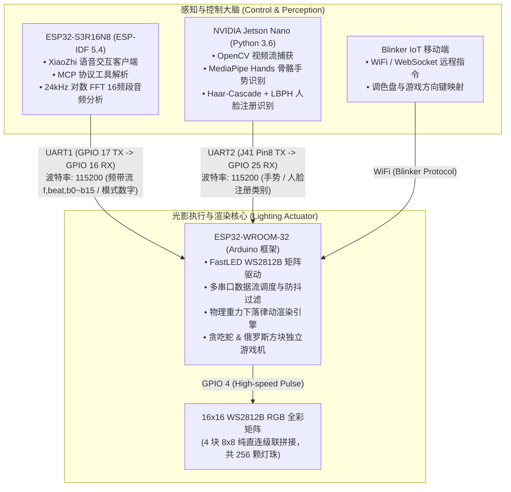

# Intelligent Lighting Control System (Mid-Stage)
### 智能光影交互系统（大三中阶完整工程归档）

<p align="left">
  <b>语言切换 / Language / 言語切替:</b><br>
  <a href="README.md"><b>🇨🇳 中文</b></a> | 
  <a href="README_EN.md"><b>🇺🇸 English</b></a> | 
  <a href="README_JA.md"><b>🇯🇵 日本語</b></a>
</p>

[](https://idf.espressif.com/)
[](https://www.arduino.cc/)
[](https://developer.nvidia.com/embedded/jetson-nano)
[](LICENSE)

> 🎓 **通关式项目课程——大三中阶完整归档 (Mid-Stage Project Archive)**  
> 本仓库为智能光影交互系统的中阶实现，采用 **“双单片机分布式通信 + 边缘视觉端协同”** 架构，实现了语音控制、256点阵炫彩光效、高灵敏度音频随动、经典交互小游戏以及低延迟视觉手势与人脸识别联动。  
> 🔗 **大四高阶演进工程**：[Intelligent-Lighting-Control-System-Pro](https://github.com/DongFengPo1412/Intelligent-Lighting-Control-System-Pro)（单芯片 S3 归一化与具身多模态架构）

---

## 📺 实物运行与功能演示视频 (Video Demo)

系统完整功能的实机运行演示已录制并发布在 Bilibili：  
👉 **[点击观看 Bilibili 演示视频：通关式项目课程——智能灯光控制系统实机演示](https://www.bilibili.com/video/BV192GR6kEHy)**  
*(涵盖小智语音交互呼叫、14种灯效切换、Blinker 手机遥控、贪吃蛇/俄罗斯方块游戏、Jetson Nano 视觉手势人脸联动以及音乐高频实时频谱随动)*

---

## 🏛️ 系统拓扑架构 (System Architecture)

系统由三个异构计算节点组成，通过硬件 UART 异步串口协议与局域网网络进行松耦合数据交互：



---

## 📁 仓库工程结构说明 (Directory Structure)

```text
.
├── esp32-s3r16n8-idf/          # ESP32-S3 端工程 (ESP-IDF 5.4 开发，小智语音 + FFT 音频分析)
├── esp32-wroom-32-arduino/     # ESP32-WROOM-32 灯阵端工程 (Arduino 开发，矩阵渲染驱动)
│   ├── esp32-wroom-32-arduino.ino # 灯控核心状态机、串口调度与主循环
│   ├── DisplayManager.h        # 14种炫彩特效、几何表情渲染与 5x3 数字字库
│   ├── GameEngine.h            # 贪吃蛇与俄罗斯方块核心游戏逻辑
│   ├── SpectrumManager.h       # 16频段音频随动物理重力下落引擎
│   ├── BlinkerManager.h        # Blinker IoT 移动端按键回调绑定
│   ├── Config.h                # 引脚映射、串口波特率与功耗安全上限配置
│   └── Config.example.h        # WiFi 及 Blinker 鉴权凭证模版
├── jetson-nano-py36/           # NVIDIA Jetson Nano AI 视觉交互端 (Python 3.6+)
│   ├── run_gesture.py          # 基础手指计数识别 (0~5)
│   ├── run_gesture2.py         # 预设特定高级手势映射 (摊手/胜利/握拳)
│   ├── face_system_cn.py       # 人脸注册、在线训练与实时比对系统 (支持热键交互)
│   └── face_system.py          # 人脸系统轻量精简版
├── .gitignore                  # Git 忽略规则 (过滤构建缓存与私密凭证)
├── README.md                   # 中文文档
├── README_EN.md                # 英文文档 (English)
└── README_JA.md                # 日文文档 (日本語)
```

---

## 🧮 核心算法与工程细节 (Core Algorithms & Implementation)

严格基于源码实现，代码中凝结的关键工程考量如下：

### 1. 复合矩阵空间拓扑解算算法 (Spatial Topology Mapping)
物理硬件使用 4 块 8×8 的 WS2812B 面板横向两块、纵向两块纯直连级联拼合为 16×16（共 256 颗）。为了避免开辟额外的查找表数组并节省 SRAM，在 `DisplayManager.h` 中推导并实现了纯数学闭式解算：
$$\text{blockID} = \lfloor y / 8 \rfloor \times 2 + \lfloor x / 8 \rfloor$$
$$\text{Index} = \text{blockID} \times 64 + (y \pmod 8) \times 8 + (x \pmod 8)$$
该公式可在纳秒级将笛卡尔坐标 $(x, y)$ 换算为单总线物理串行序号，保证 60FPS 渲染下的零查表开销。

### 2. 16频段音频随动重力衰减滤波算法 (Spectrum Gravity Fallback)
在 `SpectrumManager.h` 中，为了彻底解决普通灯光随动中柱状条由于电平突变产生的生硬闪烁与半空死锁问题，设计了仿生重力阻尼衰减滤波：
- 当瞬间能量增加时，高度瞬间顶起：$\text{fall}(t) = \text{band}(t)$
- 当能量跌落时，引入“固定基数 + 比例衰减”阻尼公式：
  $$\text{fall}(t) = \text{fall}(t-1) - (0.4 + 0.05 \times \text{fall}(t-1))$$
- **物理 Y 轴倒置与色彩渐变**：利用 $15 - y$ 倒算索引，让光柱从底板（3、4号板）向上成长，底部为暖橙色，柱顶冲向冷蓝紫色；若检测到重低音大鼓冲击（`beat == 1`），全屏叠加瞬态微冷冷光。

### 3. 多主控串口通信高频去抖与死守铁闸 (Anti-Collision Protocol)
两块单片机通过波特率 115200 进行高速串口通信，在 `esp32-wroom-32-arduino.ino` 中针对工业常见痛点做了多重保护：
- **消灭堆内存碎片**：使用预分配 `reserve(128)` 配合无分配的 `sscanf` 就地解析 `f,%d,%d...` 数据包，避免频繁内存分配引发的看门狗复位；
- **防偷袭重置铁闸**：当处于模式 15（音乐随动）且高频流持续涌入时，若云端心跳包误发重置 `0` 指令，硬件防御状态机在 1.2 秒内就地拦截蒸发，确保音乐随动不被打断；
- **超时断帧机制**：针对 Python 串口未发换行符的情况，设计 50ms 无字符超时主动截断解析，避免串口堵塞。

---

## 📋 系统支持模式总览 (Operation Modes)

| 模式编号 (Mode) | 模式名称 | 触发源 | 显示特征与逻辑 |
| :---: | :--- | :--- | :--- |
| **1 ~ 3** | 纯红 / 纯蓝 / 纯绿 | 语音 / 串口 / 人脸 `ylk/zzc` | 全屏恒定基色填充 (`fill_solid`) |
| **4** | 幻彩霓虹 | 语音 / 串口 / 手机 | 全局 HSV 连续色相流动 (`fill_rainbow`) |
| **5** | 呼吸极光 | 语音 / 摊手手势 | 基于 `beatsin8` 动态调制亮度与色相呼吸 |
| **6** | 流星划过 | 语音 / 胜利✌️手势 | 双轴正弦轨迹粒子运动，叠加余晖渐暗衰减 (`fadeToBlackBy`) |
| **7** | 繁星点点 | 语音 / 握拳手势 | 随机像素瞬态置白与全屏背景衰减 |
| **8 ~ 10**| 全屏渐变 / 乱序雨滴 / 中心波纹 | 语音 / 串口 / 手机 | 基于欧氏距离半径扩散的同心圆动态环形波纹 |
| **11 ~ 13**| 笑脸盈盈 / 垂头丧气 / 面无表情 | 语音 / 串口 / 手机 | 几何圆形轮廓配合口型弧度表情绘制 |
| **14** | 瞬息万变 | 语音 / 串口 | 动态切换表情与高频色彩流动 |
| **15** | **音乐频谱随动模式** | 语音 / S3 自动识别 | 解析 S3 发送的 16 列对数 FFT 数据，运行物理重力下落与鼓点闪烁 |
| **16** | AI 唤醒反馈表情 | 小智唤醒词触发 | 瞬态点亮黄色笑脸，给予视觉确认反馈 |
| **19 / 20**| **贪吃蛇游戏 / 结算记分** | 语音 / 手机按键 | 实时蛇身坐标队列移动、吃食物加速，死亡后 5x3 数字点阵呈现得分 |
| **21 / 22**| **俄罗斯方块 / 结算记分** | 语音 / 手机按键 | 7种经典旋转方块、消行加速与满屏死亡判定，5x3 点阵呈现得分 |

---

## 🔌 硬件接线与电气连接规范 (Hardware Wiring Guide)

### 1. WS2812B 16x16 矩阵接线
- **数据线 (DIN)** ➔ ESP32-WROOM-32 **GPIO 4**
- **电源 (VCC/GND)** ➔ 外部独立 5V 电源，严密共地（ESP32 GND 与灯板 GND 必须导通）
- **功耗约束**：代码内部强制调用 `FastLED.setMaxPowerInVoltsAndMilliamps(5, 1200)`，限定最大功率在 5V/1.2A 阈值内，杜绝电源拉垮重启。

### 2. 跨板 UART 异步串口互联 (ESP32-S3 ↔ ESP32-WROOM-32)
- **S3 TX (GPIO 17)** ➔ **WROOM-32 RX2 (GPIO 16)**
- **S3 RX (GPIO 18)** ➔ **WROOM-32 TX2 (GPIO 17)**
- **两板共地 (GND)** 必须连接
- **通信参数**：波特率 115200，8位数据位，1位停止位，无校验 (8N1)

### 3. Jetson Nano ↔ ESP32-WROOM-32 串口接线
⚠️ **安全警告**：由于 WROOM-32 已经由 USB/外部供电，为防止双路 5V 电源倒灌损毁板卡，**严禁连接 Jetson Nano 的 5V 针脚**。仅连接 3 根信号线：
- **Jetson Nano J41 Pin 8 (UART1_TX)** ➔ **WROOM-32 GPIO 25** (作为软件/硬件 RX)
- **Jetson Nano J41 Pin 10 (UART1_RX)** ➔ **WROOM-32 GPIO 26** (作为 TX)
- **Jetson Nano J41 Pin 9 (GND)** ➔ **WROOM-32 GND** (共地)

---

## 🚀 部署与编译指南 (Build & Run)

### 1. ESP32-WROOM-32 (Arduino 固件)
1. 使用 Arduino IDE 打开 `esp32-wroom-32-arduino/esp32-wroom-32-arduino.ino`；
2. 安装依赖库：`FastLED` (v3.6+)、`Blinker` (v0.3+)；
3. 将 `Config.example.h` 另存为 `Config.h`，填入个人的 Wi-Fi 名称、密码及 Blinker Secret Key；
4. 开发板选择 **ESP32 Dev Module**，上传速率选 921600，点击编译并烧录。

### 2. ESP32-S3R16N8 (ESP-IDF 固件)
1. 使用 VS Code 打开子目录 `esp32-s3r16n8-idf/`；
2. 确认安装 ESP-IDF 5.4+ 编译工具链；
3. 终端执行构建并烧录：
   ```bash
   idf.py set-target esp32s3
   idf.py build
   idf.py -p COMx flash monitor
   ```

### 3. NVIDIA Jetson Nano (Python 视觉系统)
```bash
# 1. 解除 Jetson Nano 后台对板载串口终端的占用
sudo systemctl stop nvgetty
sudo systemctl disable nvgetty
sudo usermod -aG dialout,video $USER
sudo reboot

# 2. 进入工程目录并赋予串口权限
cd jetson-nano-py36
sudo chmod 666 /dev/ttyTHS1

# 3. 运行对应功能 (根据需求任选其一)
python3 run_gesture.py      # 手指数量统计模式
python3 run_gesture2.py     # 高级特定手势映射模式
python3 face_system_cn.py   # 人脸识别系统 (按 S 保存新面孔，T 训练，Q 退出)
```

---

## 📜 开源许可证 (License)

本项目遵循 [MIT License](LICENSE) 开源协议，欢迎学习与学术交流。
