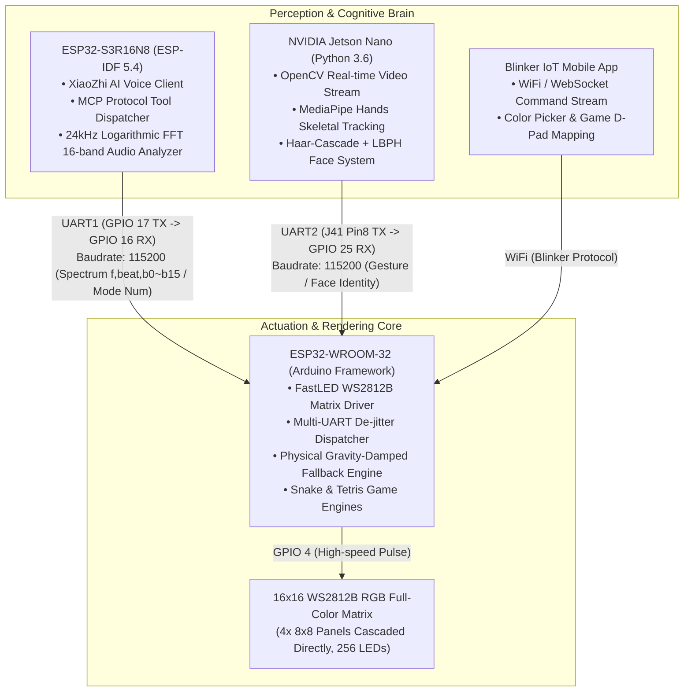

# Intelligent Lighting Control System (Mid-Stage)
### Intelligent Lighting & Acoustic Interactive System (Undergraduate Capstone Archive)

<p align="left">
  <b>Language Switch / 言語切替:</b><br>
  <a href="README.md"><b>🇨🇳 中文</b></a> | 
  <a href="README_EN.md"><b>🇺🇸 English</b></a> | 
  <a href="README_JA.md"><b>🇯🇵 日本語</b></a>
</p>

[](https://idf.espressif.com/)
[](https://www.arduino.cc/)
[](https://developer.nvidia.com/embedded/jetson-nano)
[](LICENSE)

> 🎓 **Undergraduate Course Capstone Project — Mid-Stage Archive**  
> This repository archives the mid-stage implementation of the distributed intelligent lighting control system. Adopting a **"Dual-MCU Distributed Protocol + Edge AI Vision Coprocessor"** architecture, it features offline voice control, a 256-LED color matrix, low-latency audio-reactive visualization, retro interactive arcade games, and low-latency computer vision gesture/face recognition.  
> 🔗 **Next-Gen Pro Architecture**: [Intelligent-Lighting-Control-System-Pro](https://github.com/DongFengPo1412/Intelligent-Lighting-Control-System-Pro) (Unified Single-MCU S3 & Multimodal Embodied Architecture)

---

## 📺 Live Hardware Demo Video

The complete hardware operation and live features have been recorded and published on Bilibili:  
👉 **[Watch Demo Video on Bilibili: Intelligent Lighting Control System Live Demonstration](https://www.bilibili.com/video/BV192GR6kEHy)**  
*(Demonstrating XiaoZhi voice dialogue, 14 color modes, Blinker mobile control, Snake/Tetris games, Jetson Nano gesture/face interaction, and high-frequency real-time audio spectrum visualization)*

---

## 🏛️ System Architecture

The system consists of three heterogeneous computing nodes, interacting via asynchronous UART serial protocols and local Wi-Fi:



---

## 📁 Repository Structure

```text
.
├── esp32-s3r16n8-idf/          # ESP32-S3 Project (ESP-IDF 5.4, XiaoZhi Voice + 16-band FFT)
├── esp32-wroom-32-arduino/     # ESP32-WROOM-32 Lighting Core (Arduino, Matrix Render Engine)
│   ├── esp32-wroom-32-arduino.ino # Core state machine, serial dispatcher & main loop
│   ├── DisplayManager.h        # 14 illumination effects, facial geometry & 5x3 number font
│   ├── GameEngine.h            # Snake & Tetris arcade game mechanics
│   ├── SpectrumManager.h       # 16-band physics-damped gravity audio fallback engine
│   ├── BlinkerManager.h        # Blinker IoT button event handlers
│   ├── Config.h                # Pin mappings, UART baudrates & safe power limiting
│   └── Config.example.h        # Template for WiFi credentials and Blinker auth
├── jetson-nano-py36/           # NVIDIA Jetson Nano AI Vision Subsystem (Python 3.6+)
│   ├── run_gesture.py          # Basic finger counting recognition (0 to 5)
│   ├── run_gesture2.py         # Advanced specific gesture mapping (Open hand / Victory / Fist)
│   ├── face_system_cn.py       # Face registration, online trainer & real-time inference
│   └── face_system.py          # Lightweight facial system
├── .gitignore                  # Git ignore rules (filtering build caches & secrets)
├── README.md                   # Simplified Chinese Document
├── README_EN.md                # English Document
└── README_JA.md                # Japanese Document (日本語)
```

---

## 🧮 Core Algorithms & Engineering Details

Strictly mapped to the actual codebase, the key engineering solutions include:

### 1. Spatial Topology Mapping Formula
The physical matrix is composed of four 8×8 WS2812B panels cascaded directly into a 16×16 grid (256 LEDs total). To eliminate lookup tables and save SRAM on the microcontroller, a pure mathematical closed-form transformation was derived in `DisplayManager.h`:
$$\text{blockID} = \lfloor y / 8 \rfloor \times 2 + \lfloor x / 8 \rfloor$$
$$\text{Index} = \text{blockID} \times 64 + (y \pmod 8) \times 8 + (x \pmod 8)$$
This maps Cartesian coordinates $(x, y)$ to the linear hardware LED index in nanoseconds with zero memory overhead.

### 2. 16-Band Physics-Damped Gravity Audio Fallback Engine
In `SpectrumManager.h`, to resolve the erratic flickering and mid-air stalling typical of standard sound-reactive code, an acceleration-damped fallback filter was developed:
- Rising edge instant trigger: $\text{fall}(t) = \text{band}(t)$
- Falling edge damping with combined linear and proportional decay:
  $$\text{fall}(t) = \text{fall}(t-1) - (0.4 + 0.05 \times \text{fall}(t-1))$$
- **Inverted Physical Y-Axis & Color Spectrum**: Employs $15 - y$ to grow audio columns upward from panels 3 and 4, transitioning from warm orange at the bottom to cool blue-violet at the peak. A transient cold strobe is superimposed across all LEDs when a kick drum transient is detected (`beat == 1`).

### 3. High-Frequency De-jittering & Anti-Collision UART Protocol
The dual MCUs exchange data at 115200 baud. In `esp32-wroom-32-arduino.ino`, several defensive measures are implemented:
- **Zero Heap Fragmentation**: Replaces String manipulations with pre-allocated `reserve(128)` and zero-allocation in-place `sscanf` to parse `f,%d,%d...` streams, preventing watchdog resets;
- **Audio Stream Heartbeat Filter**: While streaming Mode 15 (audio-reactive), any accidental zero-reset commands (from background heartbeat packets) are intercepted and dropped within a 1.2s window;
- **Frame Timeout Recovery**: Implements an automatic 50ms character timeout parser to handle Python scripts that omit newline delimiters (`\n`).

---

## 📋 Supported Operation Modes

| Mode ID | Mode Name | Trigger Source | Visual Characteristics |
| :---: | :--- | :--- | :--- |
| **1 ~ 3** | Solid Red / Blue / Green | Voice / Serial / Face `ylk/zzc` | Uniform solid color fill (`fill_solid`) |
| **4** | Rainbow Neon | Voice / Serial / App | Global continuous HSV rainbow shift (`fill_rainbow`) |
| **5** | Breathing Aurora | Voice / Open Palm | Dynamic brightness/hue oscillation based on `beatsin8` |
| **6** | Shooting Meteor | Voice / Victory✌️ Gesture | Dual-axis sinusoidal particle movement with trailing decay (`fadeToBlackBy`) |
| **7** | Starry Night | Voice / Closed Fist | Random pixel strobe to white against background decay |
| **8 ~ 10**| Full Color Cycle / Raindrops / Center Ripple | Voice / Serial / App | Concentric circular dynamic wave propagation based on Euclidean distance |
| **11 ~ 13**| Happy / Sad / Neutral Face | Voice / Serial / App | Geometric circular outline with smiling, crying, or flat mouth curvature |
| **14** | Dynamic Transition | Voice / Serial | Alternating dynamic face expressions with high-speed color cycles |
| **15** | **Audio Spectrum Reactive** | Voice / S3 Auto Detection | Parses 16-band logarithmic FFT from S3 with gravity fallback and beat strobe |
| **16** | AI Awakening Feedback | Voice Wake Word | Transient yellow smiling face visual feedback |
| **19 / 20**| **Snake Game / Score Display** | Voice / Mobile D-Pad | Real-time queue movement, collision checks, and 5x3 digit score display on game over |
| **21 / 22**| **Tetris Game / Score Display** | Voice / Mobile D-Pad | 7 classic tetromino shapes, line clearing acceleration, and 5x3 digit score display |

---

## 🔌 Hardware Wiring & Electrical Guide

### 1. WS2812B 16x16 Matrix
- **Data In (DIN)** ➔ ESP32-WROOM-32 **GPIO 4**
- **Power (VCC/GND)** ➔ External dedicated 5V supply, strictly common-grounded with ESP32.
- **Power Limiter**: Constrained in firmware via `FastLED.setMaxPowerInVoltsAndMilliamps(5, 1200)` to 5V / 1.2A to safeguard against power brownouts.

### 2. Dual-MCU Inter-Board UART (ESP32-S3 ↔ ESP32-WROOM-32)
- **S3 TX (GPIO 17)** ➔ **WROOM-32 RX2 (GPIO 16)**
- **S3 RX (GPIO 18)** ➔ **WROOM-32 TX2 (GPIO 17)**
- **Common Ground (GND)** must be connected.
- **Parameters**: 115200 Baud, 8 Data bits, 1 Stop bit, No Parity (8N1).

### 3. NVIDIA Jetson Nano ↔ ESP32-WROOM-32 Wiring
⚠️ **Safety Notice**: Since the WROOM-32 board is powered via USB, **DO NOT connect the 5V power pin from the Jetson Nano** to prevent reverse current damage. Connect only 3 signal wires:
- **Jetson Nano J41 Pin 8 (UART1_TX)** ➔ **WROOM-32 GPIO 25** (as RX)
- **Jetson Nano J41 Pin 10 (UART1_RX)** ➔ **WROOM-32 GPIO 26** (as TX)
- **Jetson Nano J41 Pin 9 (GND)** ➔ **WROOM-32 GND** (Common Ground)

---

## 🚀 Build & Deployment

### 1. ESP32-WROOM-32 (Arduino Firmware)
1. Open `esp32-wroom-32-arduino/esp32-wroom-32-arduino.ino` in Arduino IDE;
2. Install required libraries: `FastLED` (v3.6+), `Blinker` (v0.3+);
3. Copy `Config.example.h` to `Config.h` and configure your Wi-Fi SSID, password, and Blinker Auth key;
4. Select **ESP32 Dev Module**, set Upload Speed to 921600, compile, and flash.

### 2. ESP32-S3R16N8 (ESP-IDF Firmware)
1. Open `esp32-s3r16n8-idf/` in VS Code with ESP-IDF extension (v5.4+);
2. Build and flash via command line:
   ```bash
   idf.py set-target esp32s3
   idf.py build
   idf.py -p COMx flash monitor
   ```

### 3. NVIDIA Jetson Nano (Python Subsystem)
```bash
# 1. Disable default serial console service occupying ttyTHS1
sudo systemctl stop nvgetty
sudo systemctl disable nvgetty
sudo usermod -aG dialout,video $USER
sudo reboot

# 2. Grant permissions and launch scripts
cd jetson-nano-py36
sudo chmod 666 /dev/ttyTHS1

# 3. Run selected AI module
python3 run_gesture.py      # Finger count recognition
python3 run_gesture2.py     # Specific gesture mappings
python3 face_system_cn.py   # Facial recognition system (Press S to save, T to train, Q to quit)
```

---

## 📜 License

This project is licensed under the [MIT License](LICENSE).
