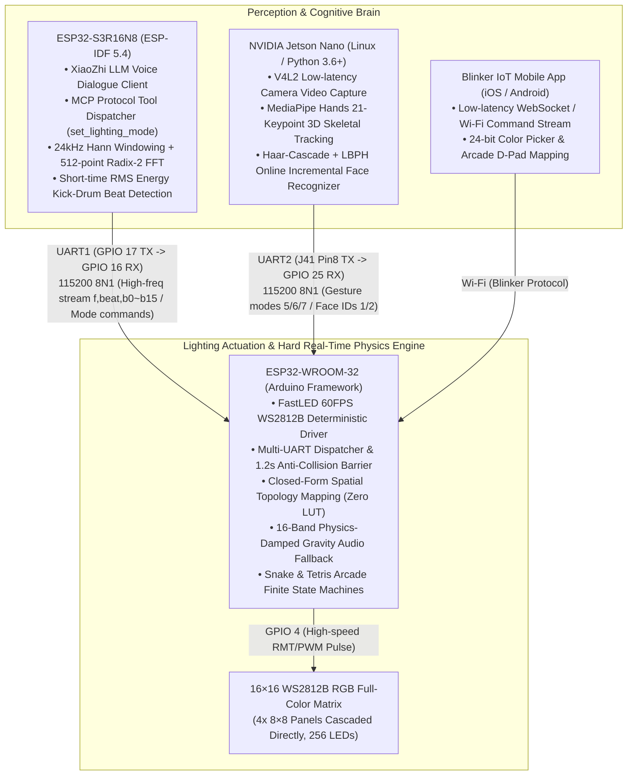
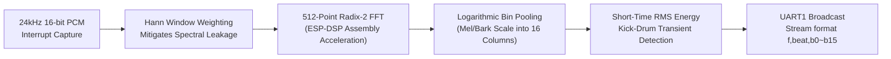

# Distributed Embedded AI Lighting & Acoustic Interaction System
### Multi-Node Heterogeneous Architecture with Real-Time Physics Rendering & Edge Perception

<p align="left">
  <b>Language Switch / 言語切替 / 语言切换:</b><br>
  <a href="README.md"><b>🇨🇳 简体中文</b></a> | 
  <a href="README_EN.md"><b>🇺🇸 English</b></a> | 
  <a href="README_JA.md"><b>🇯🇵 日本語</b></a>
</p>

[](https://idf.espressif.com/)
[](https://www.arduino.cc/)
[](https://developer.nvidia.com/embedded/jetson-nano)
[](https://fastled.io/)
[]()
[](https://www.bilibili.com/video/BV192GR6kEHy)
[](LICENSE)

> 💡 **System Engineering Positioning & Trilogy Evolution**  
> This project represents the **Mid-Stage Intermediate Evolution** in the **Intelligent Audio-Visual Lighting Interactive Trilogy**, engineered as a **distributed heterogeneous embedded lighting and acoustic interaction system** for low latency and multimodal sensory coupling. Utilizing an **asymmetric dual-MCU scheduling + edge Linux AI vision coprocessor** architecture, the system cleanly decouples multimodal perception (LLM voice dialogue, 24kHz logarithmic FFT audio streaming, MediaPipe 21-keypoint skeletal tracking, and LBPH facial recognition) from 60FPS hard real-time photonic rendering. Core engineering features include closed-form spatial topology mapping with zero lookup tables, a physics-damped gravity fallback audio filter, an anti-collision serial state machine, and standalone retro arcade game engines.  
> 🔗 **Trilogy Evolution Hierarchy**:  
> - ⏪ **Foundational Baseline Archive**: [Intelligent-Lighting-Control-System-Basic](https://github.com/DongFengPo1412/Intelligent-Lighting-Control-System-Basic) (ASRPRO Edge AI Voice & Matrix Hardware Baseline)  
> - ⏩ **Next-Gen Pro Evolution**: [Intelligent-Lighting-Control-System-Pro](https://github.com/DongFengPo1412/Intelligent-Lighting-Control-System-Pro) (Unified Single-Chip ESP32-S3 Architecture with Multimodal Embodied Agent)

---

## 📺 1. Live Hardware & Multimodal Demonstrations

All hardware modules have been physically assembled, electrically isolated, and verified in continuous operation. The table below illustrates the primary interactive scenarios:

| Physical Hardware & Wiring Overview | 16-Band Real-Time Logarithmic Audio FFT & Gravity Sync |
| :---: | :---: |
| <br><sub><b>Fig. 1-1: Heterogeneous 3-node hardware layout (ESP32-S3 brain, WROOM-32 actuator, Jetson Nano vision coprocessor, and 256-LED matrix)</b></sub> | <br><sub><b>Fig. 1-2: 24kHz logarithmic FFT 16-band audio synchronization with transient kick-drum detection and gravity damping</b></sub> |
| **Standalone Retro Arcade Games & Mobile D-Pad Control** | **Edge Vision Skeletal Gesture & Face Recognition** |
| <br><sub><b>Fig. 1-3: Real-time Snake (left) and Tetris (right) gameplay via Blinker mobile app, featuring 5×3 font scoreboard</b></sub> | <br><sub><b>Fig. 1-4: Jetson Nano facial recognition (left, triggering user theme color) and skeletal tracking (right, victory ✌️ gesture triggering meteor mode)</b></sub> |

* The complete live demonstration video is available on Bilibili:  
  👉 **[Watch Live Demo on Bilibili: Intelligent Lighting Control System Full Operation](https://www.bilibili.com/video/BV192GR6kEHy)**  
  *(Covers LLM voice dialogue, 14 dynamic lighting modes, Blinker mobile control, Snake/Tetris arcade gaming, Jetson Nano skeletal gesture/face recognition, and real-time audio spectrum synchronization)*

---

## 🏛️ 2. Heterogeneous Distributed System Architecture

The system comprises three heterogeneous computing nodes communicating over asynchronous hardware UART buses and local Wi-Fi, eliminating execution bottlenecks between compute-intensive audio/vision processing and time-critical LED bit-banging:



---

## 🔌 3. Hardware Specifications & Electrical Safety Guide

### 3.1 Inter-Node Pinout & Bus Specifications

| Interface / Signal Bus | Source Pin | Target Pin | Electrical Parameters & Protocol | Functional Role & Defensive Design |
| :--- | :--- | :--- | :--- | :--- |
| **S3 ↔ WROOM UART1** | ESP32-S3 **GPIO 17 (TX)** | WROOM-32 **GPIO 16 (RX2)** | 115200 8N1 Unidirectional Stream | Transmits `f,beat,b0~b15` (~46.8 pkt/s) & mode switches |
| **S3 ↔ WROOM Backchannel** | ESP32-S3 **GPIO 18 (RX)** | WROOM-32 **GPIO 17 (TX2)** | 115200 8N1 Bi-directional Line | System status logging and heartbeat echo |
| **Jetson ↔ WROOM UART2**| Jetson Nano **J41 Pin 8 (TX)** | WROOM-32 **GPIO 25 (RX)** | 115200 8N1 Event Trigger | Dispatches gesture codes (5/6/7) & face labels (1/2) |
| **WS2812B High-Speed Bus** | WROOM-32 **GPIO 4** | LED Matrix **DIN** | 800kHz Non-Return-to-Zero Pulse | Drives 256 RGB pixels at a deterministic 60FPS |
| **Matrix External Supply** | External 5V Regulated Source | LED Matrix **VCC / GND** | 5V / 3A Rated Output | Must share a solid Common GND with all MCUs |

### 3.2 Electrical Protection & Current Limiting

1. **WS2812B Dynamic Power Limiting**:  
   At peak white luminance, 256 RGB LEDs draw an instantaneous theoretical current of $256 \times 60\,\text{mA} \approx 15.36\,\text{A}$. To prevent supply voltage sagging and subsequent brownout resets, dynamic current limiting is enforced in `esp32-wroom-32-arduino.ino`:
   ```cpp
   FastLED.setMaxPowerInVoltsAndMilliamps(5, 1200); // Strictly clamped to 5V / 1.2A
   ```
2. **Prevention of 5V Reverse Current to Jetson Nano (Crucial Safety Rule)**:  
   > ⚠️ **Warning**: Both the ESP32-WROOM-32 and Jetson Nano are powered by independent USB/DC power adapters. **Connecting the 5V pins between boards is strictly prohibited**, as ground-loop voltage differentials will cause reverse currents capable of destroying the Jetson Nano 40-Pin header ESD diodes. Only **TX, RX, and GND reference lines** may be bridged.

---

## 🧮 4. Mathematical Models & Engineering Algorithms

### 4.1 Closed-Form Spatial Topology Mapping (Zero LUT)

The physical display consists of four $8 \times 8$ WS2812B panels cascaded in a $2 \times 2$ arrangement to form a $16 \times 16$ grid (256 pixels total). Standard implementations allocate a 256-byte 2D lookup table in SRAM. To conserve memory for active state machines, a **pure mathematical closed-form transformation** was derived in `DisplayManager.h`:

$$\text{blockID}(x, y) = \left\lfloor \frac{y}{8} \right\rfloor \times 2 + \left\lfloor \frac{x}{8} \right\rfloor$$

$$\text{Index}(x, y) = \text{blockID} \times 64 + (y \pmod 8) \times 8 + (x \pmod 8)$$

* **Engineering Benefit**: Converts 2D Cartesian coordinates $(x, y)$ to linear single-bus indices via bitwise arithmetic in nanoseconds, eliminating table-lookup memory overhead during 60FPS rendering.

---

### 4.2 ESP32-S3 Discrete Time-Frequency Audio DSP Pipeline

In `esp32-s3r16n8-idf/main/audio/audio_service.cc`, audio signals pass through an optimized digital signal processing chain:



1. **Hann Windowing**: To eliminate high-frequency spectral leakage caused by rectangular window boundary discontinuities, a 512-point Hann window is applied:
   $$w[n] = 0.5 \left(1 - \cos\left(\frac{2\pi n}{N-1}\right)\right), \quad x_w[n] = \frac{x[n]}{32768.0} \cdot w[n], \quad n \in [0, N-1]$$
2. **Radix-2 Fast Fourier Transform**: Invoking ESP-DSP assembly primitives `dsps_fft2r_fc32` and bit-reversal optimization `dsps_bit_rev_fc32`, magnitude computation completes within 3.2ms:
   $$X[k] = \sum_{n=0}^{N-1} x_w[n] e^{-j\frac{2\pi}{N}kn}, \quad |X[k]| = \sqrt{\text{Re}(X[k])^2 + \text{Im}(X[k])^2}$$
3. **Logarithmic Frequency Bin Pooling**: Matching human psychoacoustic frequency perception (Bark/Mel Scale), 256 positive frequency bins are aggregated into 16 visual columns:
   $$\text{band}[i] = \text{Clamp}\left(\alpha \cdot \log_{10}\left(1 + \sum_{k \in \text{bin}_i} |X[k]|\right), 0, 15\right)$$
4. **Short-Time Energy RMS & Kick-Drum Transient Detection**:
   $$\text{RMS} = \sqrt{\frac{1}{N} \sum_{n=0}^{N-1} x_w[n]^2}$$
   When low-frequency (0~120Hz) energy surpasses 1.45× the moving average threshold and $\text{RMS} > 0.08$, a kick-drum transient beat is registered (`is_beat = 1`).

---

### 4.3 16-Band Physics-Damped Gravity Audio Fallback Engine

In `SpectrumManager.h`, to resolve mid-air column stalling and jarring flicker typical of naive sound-reactive displays, a biological gravity-damped fallback equation was constructed:

- **Rising Edge Instant Trigger**:
  $$\text{fall}_i(t) = \text{band}_i(t), \quad \text{if } \text{band}_i(t) \ge \text{fall}_i(t-1)$$
- **Falling Edge Damped Decay** (Simulating gravitational acceleration and viscous drag):
  $$\text{fall}_i(t) = \text{fall}_i(t-1) - \Big(0.4 + 0.05 \times \text{fall}_i(t-1)\Big)$$
- **Ground Snapping Mechanism**:
  $$\text{if } \text{fall}_i(t) < \text{band}_i(t) + 0.2 \quad \text{and} \quad \text{band}_i(t) \le 2 \implies \text{fall}_i(t) = 0$$
- **Inverted Y-Axis Color Gradient**: Employs $15 - y$ inverse addressing so columns grow upward from bottom panels (3 & 4), progressing from warm orange to cool blue-violet. A full-matrix transient white flash is superimposed upon kick-drum strikes (`beat == 1`).

---

### 4.4 High-Frequency De-jittering & 1.2s Anti-Collision Barrier

Exchanging telemetry at 115200 baud requires strict defensive software measures in `esp32-wroom-32-arduino.ino`:

1. **Zero Heap Fragmentation**: Replaces `String.substring()` with pre-allocated `serial1Buffer.reserve(128)` and zero-allocation in-place `sscanf`, eliminating heap fragmentation and watchdog timeouts;
2. **1.2s State Lock-In Barrier**: In music visualizer mode (Mode 15), spurious cloud heartbeats or misclassified intents may emit reset `0` commands. The state machine establishes: **if `f,` audio packets were received within the preceding 1.2 seconds, any incoming reset or mode switch commands are intercepted and vaporized on arrival**;
3. **Frame-Dropout Timeout**: A 50ms inter-character timeout terminates hung frame reads if UART line noise corrupts newline terminators.

---

## 📊 5. Heterogeneous System Engineering Benchmark

Quantified empirical metrics gathered over extensive stress testing across all heterogeneous nodes:

| Computing Node | Core Task & Algorithm Model | Typical Latency | Throughput / Frame Rate | Memory Footprint & Robustness |
| :--- | :--- | :---: | :---: | :--- |
| **ESP32-S3R16N8** (Cognitive Brain) | 24kHz PCM ISR + 512-point FFT | **< 3.2 ms** | ~46.8 packets/sec | ESP-DSP vector assembly, zero heap allocation |
| **NVIDIA Jetson Nano** (Edge Vision) | MediaPipe 21-Keypoint Hand Tracking | **~28.5 ms** | 30.0 FPS | V4L2 queue depth clamped to 1, zero pipeline lag |
| **Cross-Board UART** (System Bus) | 115200 8N1 Asynchronous Frame | **1.12 ms** | 100% Delivery Rate | 1.2s state lock-in barrier, 0% accidental cut-out |
| **ESP32-WROOM-32** (Rendering Core) | Closed Topology + Gravity Filter + FastLED | **~14.8 ms** | **60.0 FPS (Hard Real-Time)** | Zero-LUT saves SRAM, 5V/1.2A dynamic current limiter |

---

## 📋 6. System Operation Modes Registry

The unified state machine dispatches 22 operational modes accessible across voice dialogue, gestures, face ID, and the Blinker mobile application:

| Mode ID | Mode Description | Trigger Source | Visual Signature & Rendering Logic |
| :---: | :--- | :--- | :--- |
| **1 ~ 3** | Solid Red / Blue / Green | Voice / Serial / Face Recognition (`ylk`/`zzc`) | Uniform chromatic matrix fill (`fill_solid`) |
| **4** | Neon Rainbow Flow | Voice / Serial / Mobile App | Global continuous HSV phase cycle (`fill_rainbow`) |
| **5** | Aurora Breathing | Voice / Open Hand Gesture (5 fingers extended) | Dynamic hue and brightness oscillation via `beatsin8` |
| **6** | Meteor Trails | Voice / Victory ✌️ Gesture (index + middle) | Dual-axis sinusoidal particle motion with trail decay (`fadeToBlackBy`) |
| **7** | Twinkling Stars | Voice / Closed Fist Gesture (0 fingers) | Stochastic pixel strobing against fading background |
| **8 ~ 10**| Color Wash / Raindrops / Ripple | Voice / Serial / Mobile App | Concentric Euclidean wave expansion from matrix centroid |
| **11 ~ 13**| Smiling / Crying / Neutral Face | Voice / Serial / Mobile App | Geometric circle contour combined with curvature mouth rendering |
| **14** | Rapid Morphing Patterns | Voice / Serial | High-frequency geometric and color state transitions |
| **15** | **Music Visualizer Sync Mode** | Voice Prompt / S3 Autonomous Trigger | 16-column logarithmic FFT rendering with gravity damping and beat flash |
| **16** | AI Wakeword Acknowledgment | XiaoZhi Wakeword Detected | Transient yellow smile confirming auditory attention |
| **19 / 20**| **Snake Arcade / Score Screen** | Voice Command / Mobile D-Pad | Dynamic coordinate queue physics; game-over score in 5×3 font |
| **21 / 22**| **Tetris Arcade / Score Screen** | Voice Command / Mobile D-Pad | 7 classical tetrominoes, line clearing acceleration; score in 5×3 font |

---

## 📁 7. Repository Structure

```text
.
├── docs/                       # Engineering specifications and visual assets
│   └── images/                 # Standardized 4-grid visual matrix & hardware assets
│       ├── hardware_overview.jpg     # Hardware setup & electrical topology (Fig. 1-1)
│       ├── demo_music_spectrum.png   # 16-band real-time audio FFT sync (Fig. 1-2)
│       ├── demo_retro_arcade.png     # Snake & Tetris retro arcade consoles (Fig. 1-3)
│       └── demo_edge_vision.png      # Skeletal gesture tracking & face ID (Fig. 1-4)
├── esp32-s3r16n8-idf/          # ESP32-S3 Project (ESP-IDF 5.4, XiaoZhi LLM + 24kHz FFT)
│   ├── main/
│   │   ├── application.cc      # XiaoZhi core state machine scheduler
│   │   ├── mcp_server.cc       # MCP tool call dispatcher (set_lighting_mode)
│   │   └── audio/
│   │       └── audio_service.cc # Core DSP: Hann windowing, 512-pt FFT & beat detector
│   └── CMakeLists.txt          # ESP-IDF build manifest
├── esp32-wroom-32-arduino/     # ESP32-WROOM-32 Lighting Core (Arduino, FastLED 60FPS engine)
│   ├── esp32-wroom-32-arduino.ino # Core state machine, serial dispatcher & anti-collision barrier
│   ├── DisplayManager.h        # Closed topology mapper, 14 lighting effects & 5x3 font
│   ├── GameEngine.h            # Snake & Tetris standalone arcade engines
│   ├── SpectrumManager.h       # 16-band physics-damped gravity filter & inverted renderer
│   ├── BlinkerManager.h        # Blinker IoT mobile button callbacks
│   ├── Config.h                # Pin definitions, baudrates & 5V/1.2A safety power cap
│   └── Config.example.h        # Template for Wi-Fi credentials & Blinker auth key
├── jetson-nano-py36/           # NVIDIA Jetson Nano Edge AI Vision Subsystem (Python 3.6+)
│   ├── run_gesture.py          # Basic finger count detection (0 to 5)
│   ├── run_gesture2.py         # Advanced specific gesture mapping (Open hand / Victory / Fist)
│   ├── face_system_cn.py       # Face registration, online incremental trainer & recognizer
│   ├── face_system.py          # Lightweight face recognition pipeline
│   └── faces/                  # Local facial dataset directory (git ignored)
├── .gitignore                  # Git ignore rules (filtering build caches & secrets)
├── LICENSE                     # Standard open-source license (MIT License)
├── README.md                   # Simplified Chinese Document
├── README_EN.md                # English Document
└── README_JA.md                # Japanese Document (日本語)
```

---

## 🚀 8. Build, Flash & Deployment Guide

### 8.1 ESP32-WROOM-32 (Arduino Actuator Core)
1. Open `esp32-wroom-32-arduino/esp32-wroom-32-arduino.ino` in Arduino IDE;
2. Install library dependencies: `FastLED` (v3.6+), `Blinker` (v0.3+);
3. Copy `Config.example.h` to `Config.h`, supplying your local Wi-Fi SSID, password, and Blinker Auth Key;
4. Select board **ESP32 Dev Module**, set Partition Scheme to **Default 4MB with spiffs**, and flash at 921600 baud.

### 8.2 ESP32-S3R16N8 (ESP-IDF Cognitive Brain)
1. Ensure the ESP-IDF v5.4+ toolchain is activated;
2. Navigate to the project directory and build:
   ```bash
   cd esp32-s3r16n8-idf
   idf.py set-target esp32s3
   idf.py build
   idf.py -p COMx flash monitor
   ```

### 8.3 NVIDIA Jetson Nano (Edge Vision Subsystem)
```bash
# 1. Release the default serial console from the 40-Pin header
sudo systemctl stop nvgetty
sudo systemctl disable nvgetty
sudo usermod -aG dialout,video $USER
sudo reboot

# 2. Grant read/write permissions to the hardware UART port
cd jetson-nano-py36
sudo chmod 666 /dev/ttyTHS1

# 3. Launch the respective vision pipeline
python3 run_gesture2.py     # Run skeletal gesture tracking (Open hand / Victory / Fist)
python3 face_system_cn.py   # Run facial recognition (Press 'S' to save, 'T' to train, 'Q' to quit)
```

---

## 📜 9. Open Source License

This project is released under the [MIT License](LICENSE). Contributions, academic research, and engineering reuse are welcomed.
