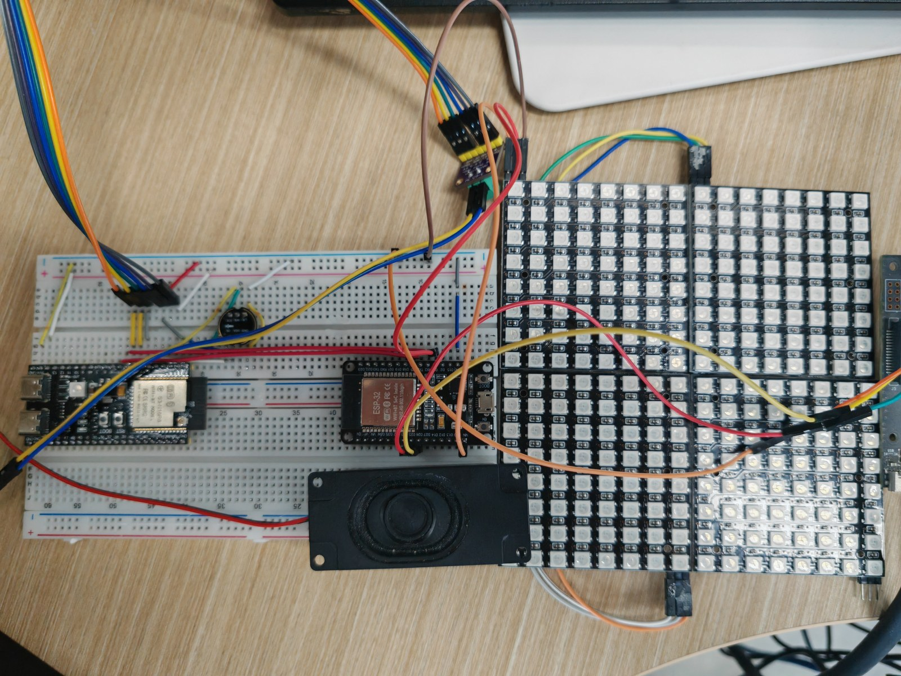
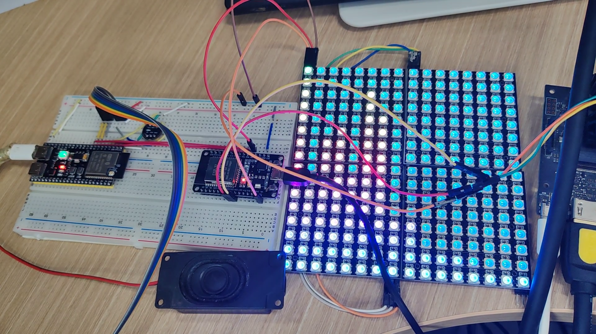
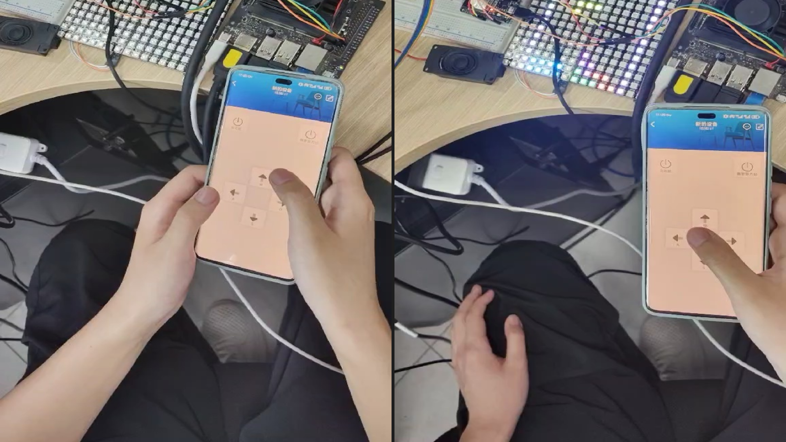
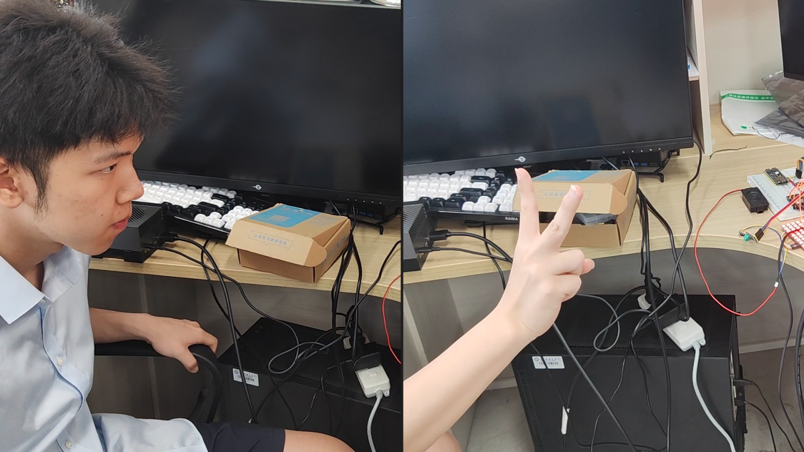
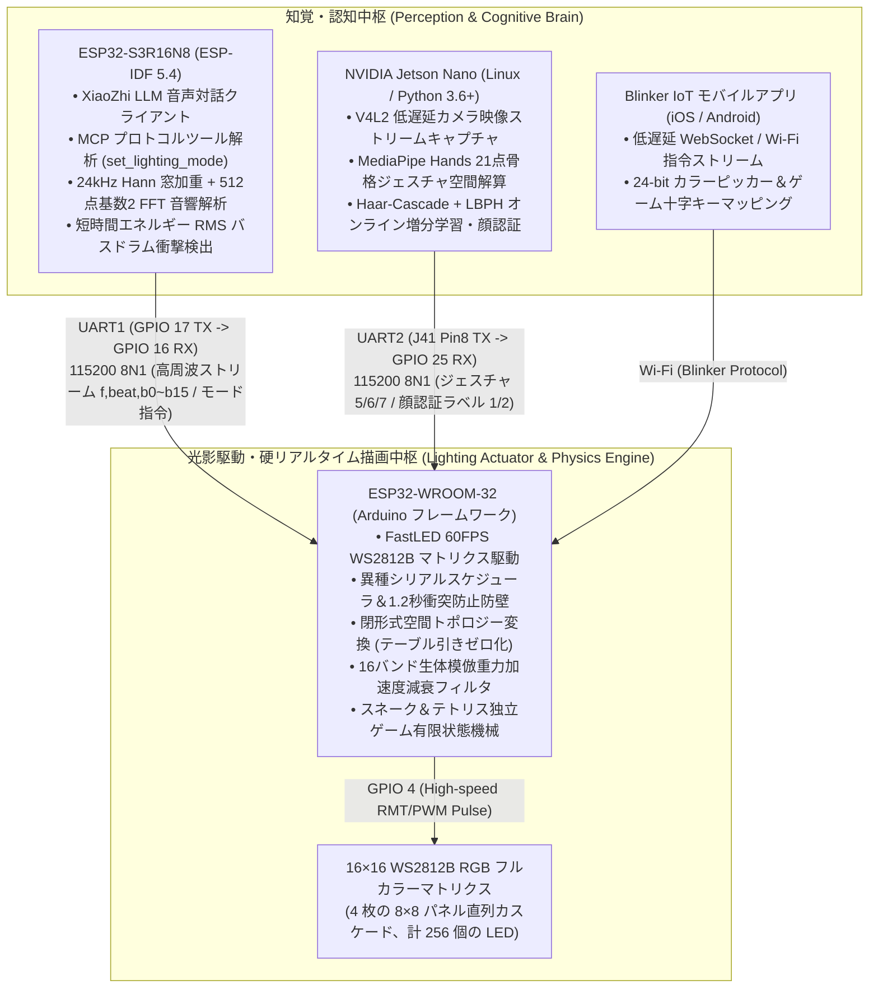
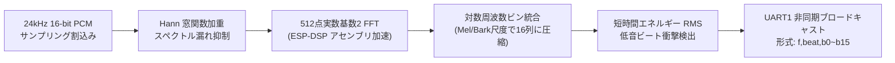

# 異種マルチMCU分散協調に基づく組込み AI 光影インタラクティブ制御システム
### Distributed Embedded AI Lighting & Acoustic Interactive System (Heterogeneous Mid-Stage Architecture)

<p align="left">
  <b>言語切替 / Language Switch / 语言切换:</b><br>
  <a href="README.md"><b>🇨🇳 简体中文</b></a> | 
  <a href="README_EN.md"><b>🇺🇸 English</b></a> | 
  <a href="README_JA.md"><b>🇯🇵 日本語</b></a>
</p>

[](https://idf.espressif.com/)
[](https://www.arduino.cc/)
[](https://developer.nvidia.com/embedded/jetson-nano)
[](https://fastled.io/)
[]()
[](https://www.bilibili.com/video/BV192GR6kEHy)
[](LICENSE)

> 💡 **プロジェクト工学的位置づけ**  
> 本システムは、極小レイテンシとマルチモーダル感覚連動を追求した**異種組込み分散型光影インタラクティブ端末**です。**「デュアルマイコン非対称ハードウェアスケジューリング＋エッジLinux AIビジョン協調」**アーキテクチャを採用し、マルチモーダル知覚（LLM音声対話、24kHz対数FFT音響ストリーム、MediaPipe 21点骨格ジェスチャ、LBPH顔認識）と 60FPS ハードリアルタイム光影レンダリングを完全分離・疎結合化しました。テーブル引きゼロの閉形式空間トポロジー変換、生体模倣重力減衰音響追従フィルタ、衝突回避シリアル状態機械防壁、および独立動作するレトロアーケードゲームエンジンを実装しています。  
> 🔗 **次世代身体性シングルチップアーキテクチャへの進化**：[Intelligent-Lighting-Control-System-Pro](https://github.com/DongFengPo1412/Intelligent-Lighting-Control-System-Pro)（ESP32-S3 単一チップ統合および身体性マルチモーダル構成）

---

## 📺 1. 実機動作・マルチモーダル機能デモ (Visual Demonstrations)

全ハードウェアモジュールは実機実装、電気的絶縁検証、および連続動作ストレステストを完了しています。主な対話シナリオは以下の通りです：

| ハードウェア実物・電気的接続全景 | 16バンドリアルタイム対数FFT音響スペクトラム同期 |
| :---: | :---: |
| <br><sub><b>図 1-1：3ノード異種ハードウェア配置（ESP32-S3頭脳、WROOM-32描画端、Jetson Nano視覚端、256点陣LED）</b></sub> | <br><sub><b>図 1-2：24kHz対数FFT 16バンド音響随動、バスドラム低音衝撃検出および重力減衰フィルタリング実測</b></sub> |
| **独立アーケードゲームエンジンとモバイルD-Pad遠隔操作** | **エッジビジョン骨格ジェスチャおよび顔認識連動** |
| <br><sub><b>図 1-3：Blinker アプリによるスネーク（左）およびテトリス（右）のリアルタイム操作（5×3フォントスコア清算対応）</b></sub> | <br><sub><b>図 1-4：Jetson Nano リアルタイム顔認識（左、固有色点灯）と骨格追跡（右、ピース✌️サインで流星パーティクル起動）</b></sub> |

* 完全な実機動作デモ動画は Bilibili にて公開されています：  
  👉 **[Bilibili で実機デモ動画を視聴する：スマート照明制御システム全機能実機稼働](https://www.bilibili.com/video/BV192GR6kEHy)**  
  *(LLM音声対話、14種類の動的エフェクト切替、Blinker アプリ遠隔操作、スネーク／テトリスゲーム、Jetson Nano 骨格ジェスチャ／顔認識、およびリアルタイム音響スペクトラム同期を収録)*

---

## 🏛️ 2. 異種分散システム全体構成 (System Architecture)

本システムは3つの異種コンピューティングノードで構成され、ハードウェア UART 拡張バスおよびローカル Wi-Fi を介して低遅延に連携します。重負荷な音声／画像処理と高精度な LED ビットバンギング間の競合を根本から排除しています：



---

## 🔌 3. ハードウェア仕様および電気的接続・安全設計 (Hardware & Electrical Guide)

### 3.1 ノード間ピンアサインおよび通信仕様

| 信号バス / インターフェース | 送信元ピン (Source) | 受信先ピン (Target) | 電気的パラメータ・プロトコル | 主要機能および保護設計 |
| :--- | :--- | :--- | :--- | :--- |
| **S3 ↔ WROOM UART1** | ESP32-S3 **GPIO 17 (TX)** | WROOM-32 **GPIO 16 (RX2)** | 115200 8N1 単方向高速通信 | `f,beat,b0~b15`（~46.8 pkt/s）およびモード切替送信 |
| **S3 ↔ WROOM 逆方向** | ESP32-S3 **GPIO 18 (RX)** | WROOM-32 **GPIO 17 (TX2)** | 115200 8N1 状態フィードバック | システム稼働状況ログおよびエコー確認 |
| **Jetson ↔ WROOM UART2**| Jetson Nano **J41 Pin 8 (TX)** | WROOM-32 **GPIO 25 (RX)** | 115200 8N1 イベントトリガー | ジェスチャ番号（5/6/7）および顔ラベル（1/2）伝送 |
| **WS2812B 高速バス** | WROOM-32 **GPIO 4** | マトリクス **DIN** | 800kHz NRZ パルス列 | 256個のRGB LEDを 60FPS 決定論的駆動 |
| **マトリクス外部電源** | 外部 5V 安定化電源 | マトリクス **VCC / GND** | 5V / 3A 定格出力 | 全マイコン・ボードと強固に共通接地 (Common GND) |

### 3.2 電気的保護および電流制限設計

1. **WS2812B 動的ピーク電流抑制**：  
   256 個の全点灯白色時における瞬間理論電流は $256 \times 60\,\text{mA} \approx 15.36\,\text{A}$ に達します。電源電圧降下によるマイコンのブラウンアウトリセット（BOR）を防ぐため、`esp32-wroom-32-arduino.ino` 内で FastLED の動的消費電力制限を強制しています：
   ```cpp
   FastLED.setMaxPowerInVoltsAndMilliamps(5, 1200); // 5V / 1.2A の閾値に厳格にクランプ
   ```
2. **Jetson Nano への 5V 電源逆流防止（最重要警告）**：  
   > ⚠️ **警告**：ESP32-WROOM-32 と Jetson Nano はそれぞれ独立した電源より給電されます。**両ボード間の 5V ピンを接続することは厳禁**です。微小な電位差によって逆流電流が発生し、Jetson Nano 40-Pin ヘッダーの保護回路が焼損する恐れがあります。接続は **TX、RX、および GND 共通基準線** のみとしてください。

---

## 🧮 4. 中核アルゴリズムおよびデジタル信号処理（DSP）数理モデル

### 4.1 複合マトリクス空間トポロジーの閉形式解法 (Spatial Topology Mapping)

物理マトリクスは 4 枚の $8 \times 8$ パネルを $2 \times 2$ 配置で直列カスケード接続し、 $16 \times 16$ グリッド（計 256 個）を構成しています。通常の2次元ルックアップテーブル（LUT）方式では SRAM を 256 バイト消費します。本システムでは `DisplayManager.h` において**純粋な数学的閉形式変換モデル**を導出しました：

$$\text{blockID}(x, y) = \left\lfloor \frac{y}{8} \right\rfloor \times 2 + \left\lfloor \frac{x}{8} \right\rfloor$$

$$\text{Index}(x, y) = \text{blockID} \times 64 + (y \pmod 8) \times 8 + (x \pmod 8)$$

* **工学的利点**：デカルト座標 $(x, y)$ から1線シリアルインデックスへの変換をナノ秒単位のビット演算に圧縮。動的状態機械用のデータ SRAM を温存し、60FPS 描画時のテーブル引きオーバーヘッドを完全に排除しました。

---

### 4.2 ESP32-S3 離散時系列・周波数解析 DSP パイプライン (Audio DSP Chain)

`esp32-s3r16n8-idf/main/audio/audio_service.cc` において、音声ストリームは最適化されたデジタル信号処理系を通過します：



1. **ハニング窓（Hann Window）**：矩形窓の境界不連続性に起因するスペクトル漏れ（Spectral Leakage）を防ぐため、512点ハニング窓関数を適用：
   $$w[n] = 0.5 \left(1 - \cos\left(\frac{2\pi n}{N-1}\right)\right), \quad x_w[n] = \frac{x[n]}{32768.0} \cdot w[n], \quad n \in [0, N-1]$$
2. **基数2 高速フーリエ変換（Radix-2 FFT）**：ESP-DSP アセンブラ関数 `dsps_fft2r_fc32` およびビット反転 `dsps_bit_rev_fc32` を呼び出し、3.2ms 以内に周波数振幅スペクトルを算出：
   $$X[k] = \sum_{n=0}^{N-1} x_w[n] e^{-j\frac{2\pi}{N}kn}, \quad |X[k]| = \sqrt{\text{Re}(X[k])^2 + \text{Im}(X[k])^2}$$
3. **対数周波数ビン統合（Logarithmic Bin Pooling）**：人間の聴覚知覚特性（Bark/Mel 尺度）に合致させるため、256 個の正周波数ビンを 16 本の光柱へ対数射影：
   $$\text{band}[i] = \text{Clamp}\left(\alpha \cdot \log_{10}\left(1 + \sum_{k \in \text{bin}_i} |X[k]|\right), 0, 15\right)$$
4. **短時間エネルギー二乗平均平方根（RMS）と低音ビート衝撃検出**：
   $$\text{RMS} = \sqrt{\frac{1}{N} \sum_{n=0}^{N-1} x_w[n]^2}$$
   低周波（0〜120Hz）エネルギーが動的適応平均閾値の 1.45 倍を超過し、かつ $\text{RMS} > 0.08$ の時、ドラム衝撃ビートを判定（`is_beat = 1`）。

---

### 4.3 16バンド生体模倣重力減衰フィルタリングアルゴリズム (Spectrum Gravity Fallback)

`SpectrumManager.h` において、従来の音響追従表示で頻発する**空中での不自然な静止停止**や**機械的な点滅**を解消するため、生体模倣型の重力減衰運動方程式を構築しました：

- **立上り過渡応答**（エネルギー増加時は瞬時に頂点へ追従）：
  $$\text{fall}_i(t) = \text{band}_i(t), \quad \text{if } \text{band}_i(t) \ge \text{fall}_i(t-1)$$
- **立下り二重減衰**（重力加速度と空気粘性抵抗の合成シミュレーション）：
  $$\text{fall}_i(t) = \text{fall}_i(t-1) - \Big(0.4 + 0.05 \times \text{fall}_i(t-1)\Big)$$
- **接地時瞬時ゼロリセット（Ground Snapping）**：
  $$\text{if } \text{fall}_i(t) < \text{band}_i(t) + 0.2 \quad \text{and} \quad \text{band}_i(t) \le 2 \implies \text{fall}_i(t) = 0$$
- **物理 Y 軸反転とヒートマップ色変化**： $15 - y$ による逆算インデックスを用い、光柱を最下部（3・4番パネル）から上方向へ成長させ、暖色オレンジから頂点の寒色ブルーバイオレットへと遷移。低音ビート検出時（`beat == 1`）は全画面に白色フラッシュを重畳。

---

### 4.4 高周波シリアル通信における衝突回避と1.2秒鉄壁防壁プロトコル

115200 ボーレート下での高速ストリーム交換に対し、`esp32-wroom-32-arduino.ino` にて産業グレードの防御機構を実装：

1. **ヒープ断片化の完全排除**：可変長 `String.substring()` を廃止し、事前確保 `serial1Buffer.reserve(128)` およびゼロ割当てインプレース `sscanf` を採用。WDTリセットを根絶；
2. **1.2秒鉄壁防壁（音楽大動脈の死守）**：音楽随動モード（モード 15）実行時、クラウドの心拍信号等から誤ってリセット `0` コマンドが飛来することがあります。本機は**直近 1.2 秒以内に `f,` パケットを受信し続けている場合、外部からの割り込み・リセット指令を現場で蒸発・無効化**します；
3. **フレーム欠落タイムアウト**：50ms の文字間タイムアウトを監視し、ノイズ等で改行記号が破損した場合でも自動で受信バッファをパージして通信閉塞を防ぎます。

---

## 📊 5. 異種分散システム工学的ベンチマーク定量測定結果 (System Benchmark)

デュアル MCU および Jetson Nano 上で連続高負荷稼働テストを実施した実測指標は以下の通りです：

| 異種計算ノード | 主要実行タスク・数理モデル | 典型処理遅延 (Latency) | スループット / 描画FPS | メモリ消費・産業堅牢性指標 |
| :--- | :--- | :---: | :---: | :--- |
| **ESP32-S3R16N8** (頭脳端) | 24kHz PCM 割込み + 512点 FFT | **< 3.2 ms** | ~46.8 パケット/秒 | ESP-DSP ベクトル最適化、ヒープ断片化ゼロ |
| **NVIDIA Jetson Nano** (視覚端) | MediaPipe 21点骨格ジェスチャ追跡 | **~28.5 ms** | 30.0 FPS | V4L2 キュー深度を 1 に制限、遅延堆積を防止 |
| **基板間 UART バス** (通信回線) | 115200 8N1 高速非同期フレーム | **1.12 ms** | 100% 安定到達率 | 1.2秒鉄壁防壁、随動中の誤切替率 0% |
| **ESP32-WROOM-32** (描画端) | 閉形式トポロジー + 重力フィルタ + FastLED | **~14.8 ms** | **60.0 FPS (硬リアルタイム)** | テーブル引きゼロで SRAM 節約、5V/1.2A 動的保護 |

---

## 📋 6. システム動作モード一覧 (Operation Modes)

統一有限状態機械により、音声コマンド、ジェスチャ、顔認証、Blinker アプリからシームレスに切替可能な全 22 モードを統括します：

| モード番号 (Mode) | モード名称 | トリガー源 | 視覚表現および描画ロジック |
| :---: | :--- | :--- | :--- |
| **1 ~ 3** | 純赤 / 純青 / 純緑 | 音声 / シリアル / 顔認証 (`ylk`/`zzc`) | 全画面単一基底色塗りつぶし (`fill_solid`) |
| **4** | ネオンレインボー | 音声 / シリアル / スマホアプリ | グローバル連続 HSV 色相巡回 (`fill_rainbow`) |
| **5** | オーロラブリージング | 音声 / 掌手勢（5本全開） | `beatsin8` による明度・色相の動的呼吸変調 |
| **6** | シューティングスター | 音声 / ピース✌️サイン（人差し指+中指） | 2軸正弦波軌道パーティクル運動＋残光減衰 (`fadeToBlackBy`) |
| **7** | トゥインクルスター | 音声 / 握拳手勢（0本屈曲） | ランダムピクセル瞬間白色化＋背景減衰 |
| **8 ~ 10**| 全画面グラデーション / ランダム雨滴 / 中心波紋 | 音声 / シリアル / スマホアプリ | ユークリッド距離半径拡散に基づく同心円動的波紋 |
| **11 ~ 13**| 笑顔 / 泣き顔 / 無表情 | 音声 / シリアル / スマホアプリ | 幾何学的円輪郭＋口元曲率による表情描画 |
| **14** | 変幻自在 | 音声 / シリアル | 高周波な幾何パターンおよび色彩動的遷移 |
| **15** | **音響スペクトラム随動モード** | 音声発話 / S3 自動起動 | 16列対数FFTデータ解析、重力減衰落下およびビート同期 |
| **16** | AI ウェイクワード応答 | XiaoZhi 呼出検出 | 黄色い笑顔を瞬間点灯、聴覚的注視を確認 |
| **19 / 20**| **スネークゲーム / スコア清算** | 音声指令 / スマホ十字キー | 動的座標キュー進行；ゲームオーバー時 5×3 点陣でスコア表示 |
| **21 / 22**| **テトリスゲーム / スコア清算** | 音声指令 / スマホ十字キー | 7種類の標準テトロミノ、行消去加速；5×3 点陣でスコア表示 |

---

## 📁 7. リポジトリ構成 (Directory Structure)

```text
.
├── docs/                       # 技術仕様および視覚アセット
│   └── images/                 # 標準化 4 グリッド実機デモ画像マトリクス
│       ├── hardware_overview.jpg     # ハードウェア実機配置・配線トポロジー (図 1-1)
│       ├── demo_music_spectrum.png   # 16バンドリアルタイム音響FFT同期実測 (図 1-2)
│       ├── demo_retro_arcade.png     # スネーク＆テトリス独立ゲーム機 (図 1-3)
│       └── demo_edge_vision.png      # 骨格ジェスチャ追跡＆顔認識連動 (図 1-4)
├── esp32-s3r16n8-idf/          # ESP32-S3 プロジェクト (ESP-IDF 5.4, XiaoZhi LLM + 24kHz FFT)
│   ├── main/
│   │   ├── application.cc      # システム状態機械スケジューラ
│   │   ├── mcp_server.cc       # MCP ツール呼出ディスパッチャ (set_lighting_mode)
│   │   └── audio/
│   │       └── audio_service.cc # コア DSP：Hann 窓、512点 FFT、ビート検出器
│   └── CMakeLists.txt          # ESP-IDF ビルド定義
├── esp32-wroom-32-arduino/     # ESP32-WROOM-32 描画コア (Arduino, FastLED 60FPS 駆動)
│   ├── esp32-wroom-32-arduino.ino # コア状態機械、シリアルディスパッチャ＆衝突防止防壁
│   ├── DisplayManager.h        # 閉形式トポロジー解算、14種のエフェクト＆5x3フォント
│   ├── GameEngine.h            # スネーク＆テトリスゲームロジック
│   ├── SpectrumManager.h       # 16バンド重力減衰フィルタ＆反転レンダラ
│   ├── BlinkerManager.h        # Blinker IoT ボタンイベントハンドラ
│   ├── Config.h                # ピン配置、ボーレート＆5V/1.2A安全電力制限
│   └── Config.example.h        # Wi-Fi 接続情報および認証キーテンプレート
├── jetson-nano-py36/           # NVIDIA Jetson Nano エッジ AI ビジョン端 (Python 3.6+)
│   ├── run_gesture.py          # 基本指カウント認識モード (0 〜 5)
│   ├── run_gesture2.py         # 高度特定ジェスチャ追跡 (掌 / ピース / 握拳)
│   ├── face_system_cn.py       # 顔登録、オンライン増分学習・認識システム
│   ├── face_system.py          # 軽量顔認識パイプライン
│   └── faces/                  # 顔画像データセット保存先 (git ignored)
├── .gitignore                  # Git 除外設定 (中間バイナリ・秘密鍵を排除)
├── LICENSE                     # オープンソースライセンス (MIT License)
├── README.md                   # 簡体字中国語ドキュメント
├── README_EN.md                # 英語ドキュメント (English)
└── README_JA.md                # 日本語ドキュメント (日本語)
```

---

## 🚀 8. ビルド・デプロイ手順 (Build & Run)

### 8.1 ESP32-WROOM-32 (Arduino 描画コア)
1. Arduino IDE にて `esp32-wroom-32-arduino/esp32-wroom-32-arduino.ino` を開きます；
2. 依存ライブラリをインストール：`FastLED` (v3.6+)、`Blinker` (v0.3+)；
3. `Config.example.h` を `Config.h` にコピー＆リネームし、Wi-Fi SSID、パスワード、および Blinker Secret Key を設定します；
4. ボードに **ESP32 Dev Module**、Partition Scheme に **Default 4MB with spiffs** を指定し、921600 ボーで書き込みます。

### 8.2 ESP32-S3R16N8 (ESP-IDF 頭脳コア)
1. ESP-IDF v5.4+ 環境が有効化されていることを確認します；
2. ディレクトリへ移動し、ビルドとフラッシュを実行します：
   ```bash
   cd esp32-s3r16n8-idf
   idf.py set-target esp32s3
   idf.py build
   idf.py -p COMx flash monitor
   ```

### 8.3 NVIDIA Jetson Nano (エッジ視覚システム)
```bash
# 1. 40-Pin ヘッダーのシリアルコンソール独占を解除
sudo systemctl stop nvgetty
sudo systemctl disable nvgetty
sudo usermod -aG dialout,video $USER
sudo reboot

# 2. ハードウェアシリアルポートの読取・書込権限を付与
cd jetson-nano-py36
sudo chmod 666 /dev/ttyTHS1

# 3. 目的のビジョンパイプラインを起動
python3 run_gesture2.py     # 骨格ジェスチャ追跡モード (掌 / ピース / 握拳)
python3 face_system_cn.py   # 顔認識システム (Sキーで保存、Tキーで再学習、Qキーで終了)
```

---

## 📜 9. オープンソースライセンス (License)

本プロジェクトは [MIT License](LICENSE) の下で公開されています。学術研究、技術検証、および工学的再利用を歓迎します。
