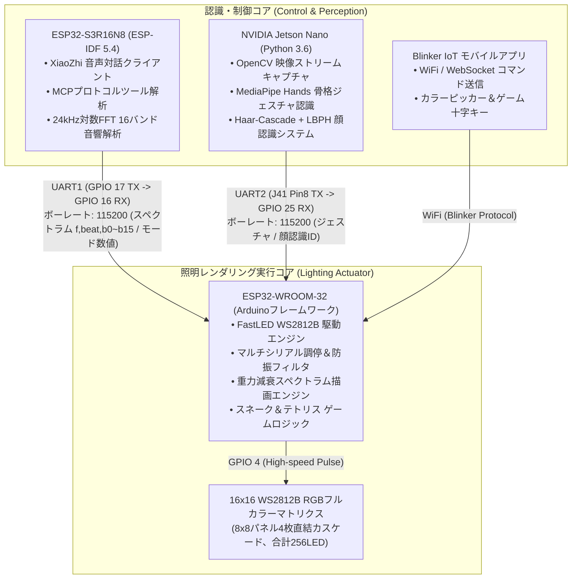

# Intelligent Lighting Control System (Mid-Stage)
### インテリジェント・ライティング＆音響インタラクティブシステム（学部プロジェクト成果アーカイブ）

<p align="left">
  <b>言語切替 / Language Switch:</b><br>
  <a href="README.md"><b>🇨🇳 中文</b></a> | 
  <a href="README_EN.md"><b>🇺🇸 English</b></a> | 
  <a href="README_JA.md"><b>🇯🇵 日本語</b></a>
</p>

[](https://idf.espressif.com/)
[](https://www.arduino.cc/)
[](https://developer.nvidia.com/embedded/jetson-nano)
[](LICENSE)

> 🎓 **大学通関型創成プロジェクト——学部中間成果（Mid-Stage Archive）**  
> 本リポジトリは、分散型スマート照明インタラクティブシステムの中間実装をまとめたものです。**「デュアルマイコン非同期通信＋エッジAIビジョン協調」**アーキテクチャを採用し、音声制御、256個のRGB LEDマトリクス制御、高感度音響スペクトラム同期、レトロゲーム機能、および低遅延な骨格ジェスチャ・顔認識連携を実現しました。  
> 🔗 **次世代上位プロジェクト**：[Intelligent-Lighting-Control-System-Pro](https://github.com/DongFengPo1412/Intelligent-Lighting-Control-System-Pro)（単一 S3 マイコン統合および身体性マルチモーダル構成）

---

## 📺 実機動作・機能デモ動画 (Video Demo)

システムの完全な実機動作デモは Bilibili にて公開されています：  
👉 **[Bilibili で実機デモ動画を視聴する：通関型プロジェクト——スマート照明制御システム](https://www.bilibili.com/video/BV192GR6kEHy)**  
*(XiaoZhi 音声対話、14種類の照明エフェクト切替、Blinker アプリ遠隔操作、スネーク／テトリスゲーム、Jetson Nano ジェスチャ・顔認識、リアルタイム音響スペクトラム同期を収録)*

---

## 🏛️ システム全体構成 (System Architecture)

本システムは3つの異種コンピューティングノードで構成され、UARTシリアル通信とWi-Fiネットワークを介して低遅延に連携します：



---

## 📁 ディレクトリ構成 (Directory Structure)

```text
.
├── esp32-s3r16n8-idf/          # ESP32-S3 側プロジェクト (ESP-IDF 5.4、音声対話＋16バンドFFT解析)
├── esp32-wroom-32-arduino/     # ESP32-WROOM-32 照明実行部 (Arduino、マトリクス描画)
│   ├── esp32-wroom-32-arduino.ino # メインループ、シリアル通信調停、ステートマシン
│   ├── DisplayManager.h        # 14種類のエフェクト、幾何学フェイス描画、5x3フォント
│   ├── GameEngine.h            # スネーク＆テトリスのゲームロジック
│   ├── SpectrumManager.h       # 16バンド物理重力減衰音響エンジン
│   ├── BlinkerManager.h        # Blinker IoT ボタンイベントハンドラ
│   ├── Config.h                # ピン配置、通信速度、電力安全リミッター設定
│   └── Config.example.h        # Wi-Fi / Blinker 認証情報のテンプレート
├── jetson-nano-py36/           # NVIDIA Jetson Nano AIビジョン側 (Python 3.6+)
│   ├── run_gesture.py          # 指の本数カウント認識 (0〜5)
│   ├── run_gesture2.py         # 特定ジェスチャ認識 (パー/チョキ/グー)
│   ├── face_system_cn.py       # 顔登録・オンライン学習・リアルタイム照合システム
│   └── face_system.py          # 顔認識システム軽量版
├── .gitignore                  # Git除外設定 (ビルドキャッシュ、機密情報)
├── README.md                   # 中国語ドキュメント (簡体中文)
├── README_EN.md                # 英語ドキュメント (English)
└── README_JA.md                # 日本語ドキュメント (日本語)
```

---

## 🧮 コアアルゴリズムと実装の工夫 (Core Algorithms)

ソースコードに忠実に実装された主要な技術的アプローチは以下の通りです：

### 1. 複合マトリクス空間トポロジー変換アルゴリズム
物理ハードウェアは 4 枚の 8×8 WS2812B パネルを縦横に直結カスケードして 16×16（計 256 LED）を構成しています。ルックアップテーブルによる SRAM 消費を避けるため、`DisplayManager.h` において数式によるダイレクト座標変換を導出・実装しました：
$$\text{blockID} = \lfloor y / 8 \rfloor \times 2 + \lfloor x / 8 \rfloor$$
$$\text{Index} = \text{blockID} \times 64 + (y \pmod 8) \times 8 + (x \pmod 8)$$
ナノ秒単位でデカルト座標 $(x, y)$ をシリアル信号のインデックスへ変換し、ゼロメモリオーバーヘッドで 60FPS の高速描画を担保しています。

### 2. 16バンド音響スペクトラム重力減衰フィルタ
`SpectrumManager.h` において、音声信号の急激な変化によるチラつきや表示の途中停止を防ぐため、物理モデルに基づいた重力減衰フィルタを構築しました：
- エネルギー上昇時：瞬時にピーク追従 $\text{fall}(t) = \text{band}(t)$
- エネルギー降下時：「固定減衰＋比例減衰」による滑らかなフォールバック：
  $$\text{fall}(t) = \text{fall}(t-1) - (0.4 + 0.05 \times \text{fall}(t-1))$$
- **物理Y軸反転とカラーグラデーション**：$15 - y$ による逆算を行い、下部パネルから上部パネルへ光柱が伸長。下部は暖色系オレンジ、上部は寒色系ブルーへ遷移します。さらに重低音キック（`beat == 1`）検出時には全画面にクールホワイトの閃光を重畳します。

### 3. 多重シリアル通信の防振・パケット衝突防止プロトコル
2つのマイコンは 115200 bps の高速シリアルで通信します。`esp32-wroom-32-arduino.ino` では組込み特有の課題に対する防御策を実装しました：
- **動的メモリ断片化の根絶**：`reserve(128)` による事前確保と動的割り当てを行わない `sscanf` により `f,%d,%d...` をインプレース解析し、ヒープ破壊による WDT リセットを完全防止；
- **音響ストリーム保護ゲート**：モード15（音響同期）実行中にバックグラウンドのキープアライブ等による意図しないリセット信号（`0`）が到来した場合、1.2秒以内は即座に無効化し、再生を保護；
- **タイムアウト自動フレーム分割**：改行記号（`\n`）が欠落した場合でも、50ms 以上の無信号を検知して自動でパケット解析・バッファクリアを実行。

---

## 📋 動作モード一覧 (Operation Modes)

| モードID | モード名 | トリガー源 | 描画ロジック |
| :---: | :--- | :--- | :--- |
| **1 ~ 3** | 単色 赤 / 青 / 緑 | 音声 / シリアル / 顔認識 `ylk/zzc` | 全画面単色塗りつぶし (`fill_solid`) |
| **4** | レインボーネオン | 音声 / シリアル / アプリ | 全体 HSV 色相グラデーション移動 (`fill_rainbow`) |
| **5** | ブリージングオーロラ | 音声 / パー（開いた手） | `beatsin8` に基づく輝度と色相の呼吸リズム |
| **6** | シューティングメテオ | 音声 / チョキ（ピース） | 2軸正弦波によるパーティクル軌跡と残光減衰 (`fadeToBlackBy`) |
| **7** | スターリーナイト | 音声 / グー（握り拳） | ランダムな白色ストロボと背景減衰 |
| **8 ~ 10**| 全画面推移 / ランダム雨粒 / 中心波紋 | 音声 / シリアル / アプリ | ユークリッド距離に基づく同心円状の動的波紋アニメーション |
| **11 ~ 13**| 笑顔 / 泣き顔 / 無表情 | 音声 / シリアル / アプリ | 円形輪郭と口の曲線幾何学によるフェイス描画 |
| **14** | 変幻自在 | 音声 / シリアル | 表情の動的切り替えと高速カラーサイクル |
| **15** | **音響スペクトラム同期モード** | 音声 / S3 自動認識 | S3 からの16バンド対数FFT解析値を受け取り、重力減衰とビート閃光を描画 |
| **16** | AI起動フィードバック | 音声ウェイクワード | 黄色い笑顔による視覚的アクティベーション応答 |
| **19 / 20**| **スネークゲーム / スコア表示** | 音声 / アプリ十字キー | リアルタイム座標キュー処理、衝突判定、ゲームオーバー時の 5x3 数字スコア表示 |
| **21 / 22**| **テトリス / スコア表示** | 音声 / アプリ十字キー | 7種類のテトリミノ、ライン消去加速、ゲームオーバー時の 5x3 数字スコア表示 |

---

## 🔌 配線仕様・電気的接続ガイド (Hardware Wiring)

### 1. WS2812B 16x16 マトリクス配線
- **データ信号線 (DIN)** ➔ ESP32-WROOM-32 **GPIO 4**
- **電源線 (VCC/GND)** ➔ 外部独立 5V 電源（ESP32 の GND と必ず共通接地）
- **電力制限設定**：ファームウェア内で `FastLED.setMaxPowerInVoltsAndMilliamps(5, 1200)` を設定し、最大電流を 5V / 1.2A に制限して電源電圧降下を防止。

### 2. マイコン間 UART 通信配線 (ESP32-S3 ↔ ESP32-WROOM-32)
- **S3 TX (GPIO 17)** ➔ **WROOM-32 RX2 (GPIO 16)**
- **S3 RX (GPIO 18)** ➔ **WROOM-32 TX2 (GPIO 17)**
- **共通GND (GND)** を必ず接続。
- **通信仕様**：115200 bps, 8ビットデータ, 1ストップビット, パリティなし (8N1)。

### 3. NVIDIA Jetson Nano ↔ ESP32-WROOM-32 配線
⚠️ **安全警告**：WROOM-32 はすでに外部/USB給電されているため、5Vの逆流事故を防止するため**Jetson Nano の 5V ピンは絶対に接続しないでください**。以下の3本のみを接続します：
- **Jetson Nano J41 Pin 8 (UART1_TX)** ➔ **WROOM-32 GPIO 25** (受信側)
- **Jetson Nano J41 Pin 10 (UART1_RX)** ➔ **WROOM-32 GPIO 26** (送信側)
- **Jetson Nano J41 Pin 9 (GND)** ➔ **WROOM-32 GND** (共通接地)

---

## 🚀 ビルドと導入手順 (Build & Deployment)

### 1. ESP32-WROOM-32 (Arduino)
1. Arduino IDE で `esp32-wroom-32-arduino/esp32-wroom-32-arduino.ino` を開きます；
2. 依存ライブラリを導入：`FastLED` (v3.6+)、`Blinker` (v0.3+)；
3. `Config.example.h` を `Config.h` にコピーし、Wi-FiのSSID、パスワード、Blinkerの認証キーを設定；
4. ボードに **ESP32 Dev Module** を選択し、書き込み速度 921600 でビルド・書き込みを実行します。

### 2. ESP32-S3R16N8 (ESP-IDF)
1. VS Code で `esp32-s3r16n8-idf/` を開きます（ESP-IDF v5.4+ 必須）；
2. ターミナルからビルドと書き込みを実行します：
   ```bash
   idf.py set-target esp32s3
   idf.py build
   idf.py -p COMx flash monitor
   ```

### 3. NVIDIA Jetson Nano (Python)
```bash
# 1. シリアルポートを占有する標準 nvgetty サービスを無効化
sudo systemctl stop nvgetty
sudo systemctl disable nvgetty
sudo usermod -aG dialout,video $USER
sudo reboot

# 2. プロジェクトディレクトリへ移動し、ポート権限を付与
cd jetson-nano-py36
sudo chmod 666 /dev/ttyTHS1

# 3. 目的のプログラムを実行
python3 run_gesture.py      # 指の本数認識モード
python3 run_gesture2.py     # 特定ジェスチャ割り当てモード
python3 face_system_cn.py   # 顔認識システム（Sキーで新規顔保存、Tキーで再学習、Qキーで終了）
```

---

## 📜 ライセンス (License)

本プロジェクトは [MIT License](LICENSE) の下で公開されています。
