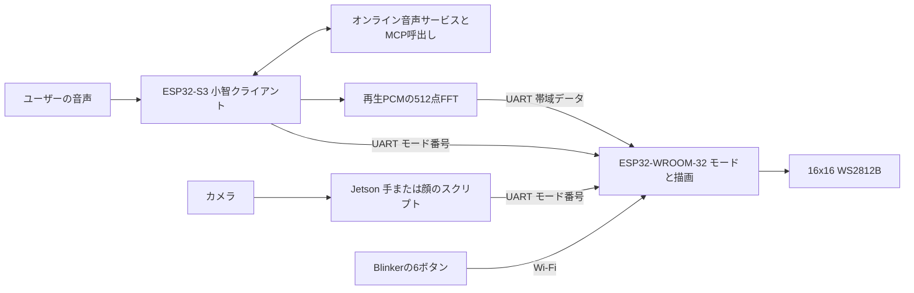

# Intelligent Lighting Control System — Mid

2台のESP32、Jetson Nano、オンライン音声対話、再生音の周波数解析を組み合わせた照明操作の試作機です。

[简体中文](README.md) · [English](README_EN.md) · **日本語**

**詳細：** [モジュールと版](docs/technical-notes.ja.md#source-map) · [音声処理](docs/technical-notes.ja.md#audio) · [描画とゲーム](docs/technical-notes.ja.md#display-games) · [視覚操作](docs/technical-notes.ja.md#vision) · [導入と操作](docs/setup.ja.md)

Mid（「智光魔方」）は、**Basic → Mid → Pro**の中級授業用プロトタイプです。ESP32-S3がオープンソースの小智クライアントでオンライン音声サービスに接続し、ESP32-WROOM-32が照明とゲームを実行します。Jetson Nanoは登録済みの顔や定義済みジェスチャをカメラで認識し、UARTで表示モードを指令します。

[Basic](https://github.com/DongFengPo1412/Intelligent-Lighting-Control-System-Basic)の定型オフライン命令とランダム照明から発展し、サーバー側の音声ツール呼出し、実際の再生音のFFT解析、視覚操作、テトリスを追加しました。[Pro](https://github.com/DongFengPo1412/Intelligent-Lighting-Control-System-Pro)は別の実装であり、本ページはMidのみを扱います。

写真は8×8パネル4枚を使った授業時の構成で、Jetsonノード全体は写っていません。**現在のローカルソースは1枚の16×16パネルを行ごとの蛇行配線で扱います。この改版のビルド・書込み・実機検証記録はなく、過去の写真は改版の動作証拠ではありません。** [版と検証範囲](docs/technical-notes.ja.md#implementation-status)

## システム構成

```mermaid
flowchart LR
    User[ユーザーの音声] --> S3[ESP32-S3 小智クライアント]
    S3 <--> Service[オンライン音声サービスとMCP呼出し]
    S3 --> DSP[再生PCMの512点FFT]
    DSP -->|UART 帯域データ| WROOM[ESP32-WROOM-32 モードと描画]
    S3 -->|UART モード番号| WROOM
    Camera[カメラ] --> Jetson[Jetson 手または顔のスクリプト]
    Jetson -->|UART モード番号| WROOM
    Phone[Blinkerの6ボタン] -->|Wi-Fi| WROOM
    WROOM --> Matrix[16x16 WS2812B]
```

S3は音声クライアントと再生音解析、WROOMはピクセル描画、シリアル分配、ゲーム更新を担当します。視覚処理は個別に起動するスクリプトで、顔と手を統合するスケジューラはありません。オンライン対話と楽曲要求には外部サービスが必要で、基本的なシリアル照明とゲーム処理はWROOM上で実行します。

## 機能と実装

| 機能 | 実装方法 | 対応範囲 |
| :--- | :--- | :--- |
| **音声操作** | 小智が音声と会話通信を処理し、`self.device.set_light_mode`がサーバーの引数をシリアル番号に変換。 | 既存音声基盤を統合。独自LLMのローカル学習はなく、楽曲検索・再生はサーバーのツールに依存。 |
| **照明と表情** | FastLEDの塗り、HSV、正弦変化、減衰と、自作のピクセル幾何描画を組合せ。 | 1–14は単色、虹、呼吸、流星、星、雨、波紋、表情。すべてがアニメーションではありません。 |
| **再生音のスペクトル** | 再生キューPCMにHann窓、512点FFT、16帯域平均、正規化、振幅の対数圧縮を適用。 | 環境音ではなくスピーカーに送る音声を解析。WROOMが経験的減衰と色の加算で表示。 |
| **2種類のゲーム** | スネークの境界折返し・自身衝突・食物による加速、テトリスの7形状・回転・衝突・行消去。 | 19／21で開始し、20／22で5×3字形による2桁得点を表示。 |
| **スマートフォン操作** | `BLINKER_WIFI`でW/S/A/D/E/Fを登録。 | 方向・回転・下移動と2ゲームの開始。カラーピッカーや汎用照明選択のコールバックはありません。 |
| **手と顔のイベント** | MediaPipe Handsの座標に対する規則判定、Haar検出とOpenCV LBPHによる登録画像との照合。 | 開いた手／ピース／握り拳は5／6／7、登録名`ylk`／`zzc`は1／2、赤／青に対応。 |

[モード、アルゴリズム、対応ソース、制約](docs/technical-notes.ja.md)

## 主な設計

- **処理のノード分担：** 音声・再生解析、視覚、表示を3ノードに分け、テキストのシリアル通信で接続し、入力経路を個別に調査できます。
- **共通座標変換：** 通常描画とスペクトル表示は`MatrixLayout::PixelIndex`を共有し、現在は1枚の16×16パネルの偶奇行方向を計算します。
- **音から描画まで：** S3が`f,beat,b0,...,b15`を送り、WROOMは解析後すぐにスペクトルを更新します。通常表示はメインループで30 msを超える間隔で送出します。
- **切替競合への対応：** S3入力は1.2 sの音楽ストリーム保護を設け、スマートフォンからのゲーム開始も音楽中は禁止します。Jetson／USBには同じ保護がなく、全入力の排他制御ではありません。

数式、帯域境界、ゲーム、プロトコル上の問題は[技術ノート](docs/technical-notes.ja.md)、導入と機能別確認は[操作ガイド](docs/setup.ja.md)にまとめています。

## 授業のデモと現在の状態

| マトリックス表示の一場面 | スマートフォン操作の一場面 |
| :---: | :---: |
|  |  |

[授業のデモ動画](https://www.bilibili.com/video/BV192GR6kEHy)。画像と動画は授業時の試作を示し、FFT遅延、認識精度、現在の1枚パネル版の性能を証明しません。視覚操作の写真は[技術ノート](docs/technical-notes.ja.md#vision)に掲載しています。

今回の文書確認ではソースと既存資料を調査し、実機接続、再学習、ビルド、書込みは行っていません。再確認可能な遅延・到達率・長時間負荷の測定記録がないため、旧版の「60 FPSハードリアルタイム」「到達率100%」や正確なms値は掲載しません。無音フレーム、モード終了、ゲーム境界には[既知の問題](docs/technical-notes.ja.md#implementation-status)があります。

## クイックスタート

1. 現行の1枚蛇行パネルか過去の分割パネルかを確認し、電源とUART配線を照合します。
2. WROOMはArduino ESP32、FastLED、Blinkerを使用します。`Config.h`を保持し、追跡対象外の`Config.private.h`に認証情報を設定します。**古い`Config.example.h`で主設定を上書きしないでください。**
3. S3はESP-IDFを使用し、現在の依存宣言は**>=5.5.2**を要求します。実ボード、音声ピン、リソースを選択してビルドします。`set-target`だけではハードウェア設定は完了しません。
4. Jetsonには互換性のあるOpenCV contrib、MediaPipe、NumPy、pyserial、カメラと画面環境が必要です。シリアルを確認してから、手または顔のプログラムを個別に起動します。

コマンド、設定例、キーと前提条件は[導入と操作](docs/setup.ja.md)を参照してください。

## チーム・今後の作業・ライセンス

チームの授業プロジェクトで、**刘超然 / Chaoran Liu**がリポジトリを管理します。授業スライドには刘超然、张子琛、杨立科が記載されていますが、各モジュールの個人作者を確定できる粒度ではなく、全ソフトウェアを一人の単独成果とは扱いません。

今後の作業は、1枚パネル改版の検証、無音フレームとプロトコル検査の修正、モード終了方針の統一、ゲーム境界の改善、ツールチェーンと実機試験の記録です。これらは未完了の作業です。

[技術ノート](docs/technical-notes.ja.md) · [導入と操作](docs/setup.ja.md) · [Basic](https://github.com/DongFengPo1412/Intelligent-Lighting-Control-System-Basic) · [Pro](https://github.com/DongFengPo1412/Intelligent-Lighting-Control-System-Pro)

リポジトリは[MITライセンス](LICENSE)です。S3には小智クライアントと上流文書を保存しています。ESP-DSP、ESP-SR、FastLED、Blinker、OpenCV、MediaPipeなどは各ライセンスに従います。本プロジェクトの作業はアプリ統合、制御プロトコル、スペクトル描画、ゲーム、視覚イベント連携であり、ライブラリのアルゴリズム自体を独自開発とは位置付けません。
